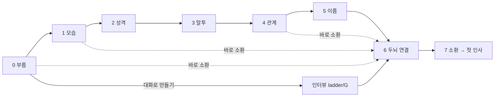

# 새 친구 소환: 첫 실행의 캐릭터 생성 마법사

> 방향 (align/D, 2026-09-28): **핵심** — 개인화 레이어가 첫 1분부터 시작된다. 사용자가 처음 서는 곳이 "내 친구를 소환하는 곳"

> 상태: **active** (2026-09-28 초안)
> 목적: 새 친구를 **소환**하는 과정을 단계형 마법사(서브컬처 게임의 캐릭터 생성 절차)로 만든다. 모든 단계에 추천값이 골라져 있고 어디서든 "바로 소환"할 수 있어 장벽은 0, 원하는 만큼 그 자리에서 내 것으로 만든다. 첫 실행의 착지점이자 이후 "새 친구 소환"의 같은 흐름.
> 관련: [personalization-ladder.md](personalization-ladder.md)(`ladder/C` 카드 쓰기·되돌리기, `ladder/G` 인터뷰) · [user-data-separation.md](user-data-separation.md)(C3 기본 캐릭터, uds/D 부트스트랩) · [plugin-architecture.md](plugin-architecture.md)(프리메이드 팩 = 콘텐츠 팩) · [direction-alignment.md](direction-alignment.md) align/K(시각 디자인, 보류) · [CONCEPT.md](../../CONCEPT.md)

## 0. 갱신: 대표 캐릭터가 코치를 소환한다 (운영자 2026-09-30, 현행 방향)

- **첫 실행은 사용자가 소환하는 장면이 아니라 소환당하는 장면이다.** 눈을 뜨니 눈앞의 존재가 「내가 당신을 불렀어」라고 말한다(이세계물의 여신·안내자 자리, 예: 원신의 페이몬). 세계관: [CONCEPT](../../CONCEPT.md) 세계관 골격, [setting-pack.md §1](setting-pack.md).
- **그 존재 = 대표 캐릭터(소환자)**, 배포판에 기본으로 들어가는 **새로 디자인한 고품질 창작 캐릭터** 하나. 마케팅·브랜딩의 얼굴이고 첫 1분의 품질을 보장한다. 노노·리리·코코가 아니다(§7 그대로). 권리는 우리 것, 성인으로 보이는 디자인(Steam 15세·어린아이 연상 금지선), 전지전능한 신이 아니라 「링크를 여는 능력 하나를 가진 이 세계의 관리인」 정도.
- **흐름**: ① 소환당함(대표 캐릭터의 첫 장면) → ② 두뇌 연결을 극 중 의식으로(「이 연결을 유지하려면 당신 세계의 힘을 빌려야 해」, D4) → ③ 사무실 안내 → ④ 소환자의 도움으로 **첫 친구 소환** = 아래 §4 마법사. 개인화는 두 번째 소환부터 시작하고, 9/28의 「첫 실행은 게임 캐릭터 생성처럼」은 ④에서 그대로 산다.
- **여행과 자발적 체류 (운영자 2026-09-30)**: 소환은 강제 납치·감금이 아니라, 초대와 링크를 통한 여행이다([setting-pack.md §1](setting-pack.md)). 캐릭터는 여권(ST 카드)을 들고 자신의 의지로 건너오며 언제든 돌아갈 수 있지만, 코치와 지내는 라운지(컴퓨터 안의 거점, 그 안의 업무 방이 사무실)가 좋아 자발적으로 머문다. 방치로 떠나는 일은 없고, 떠나는 것은 카드를 지울 때의 작별 장면 「귀향」뿐이다. 대표 캐릭터(소환자)는 이 차원 라운지의 매니저/안내자.
- 코치를 부른 이유: 컴퓨터 안의 존재들은 스스로 못 하는 일이 있다(승인·권한 부여·세계의 법칙 바꾸기). 바깥에서 온 사람만 할 수 있다 — 실제로 티켓 승인과 역할 부여는 운영자만 한다.
- 소환자는 계속 안내자로 남되 사적 관계를 강요하지 않는다. 다른 캐릭터 중심으로 지내도 된다.
- 「소환자」는 로어상의 신분이다. 그 캐릭터가 PD 같은 역할을 맡을지는 명단(`team.json`)에서 따로 정한다(로어는 권한을 주지 않는다).
- 비주얼이 아직 비어 있다: 대표 캐릭터를 그리기 전에 프로젝트의 비주얼 방향(화풍·색·분위기)부터 정한다(`ccl/G`).

### 0.1 온보딩 첫 장면 콘티 및 지문 대본 (ccl/I)

> 첫 실행 화면은 딱딱한 설정창이나 API 키 입력 폼이 아니라, 이세계로의 접속과 만남이 일어나는 **한 편의 연출 장면(스토리보드)**이다.
> 기술적 설정(계정 인증·BYOK)과 시스템 개념(라운지·사무실·도장)을 세계관 내의 행동으로 자연스럽게 치환한다.

#### 씬 ①: 소환당함 / 눈을 뜸 (소환자와의 첫 대면)
- **상황 및 배경 연출**:
  - 어두운 화면 속에서 데이터의 푸른빛 입자가 물결치며 서서히 밝아진다(페이드 인).
  - 아바타 육체(페르소나)로 실체화되어 발을 디디며 눈을 뜨는 감각.
  - 전면에 안도와 벅찬 기쁨이 섞인 표정의 대표 캐릭터(소환자 / 차원 라운지 매니저)가 서 있다.
- **지문**:
  > *(귓가에 아련한 전자음이 흩어지며, 서서히 시야가 밝아진다. 눈을 깜빡이자 눈앞에 서 있던 소녀가 안도한 숨을 내쉬며 당신을 바라본다.)*
- **대표 캐릭터 대사**:
  > "…눈을 떴군요, 코치! 신호가 닿았어… 정말로 와주셨네요!"
- **선택지 / 코치의 반응**:
  - `[여기가 대체 어디지?]`
  - `[나를… 소환한 건가?]`
  - `[코치? 날 아는 건가요?]`
- **환영 및 소환 이유 설명**:
  - **지문**: *(소환자가 라운지의 허공을 가볍게 쓸어내리자, 주변을 둘러싼 창과 데이터 패널들이 은은하게 빛을 낸다.)*
  - **대표 캐릭터 대사**:
    > "놀라지 마세요. 여긴 컴퓨터 안의 중립 지대, 우리들이 머무는 **'차원 라운지'**예요. 그리고 저는 이 차원의 문을 지키는 라운지 매니저고요."
    > "바깥 세계(현실)에 계신 코치를 여기까지 모셔온 건… 우리 힘만으로는 해결할 수 없는 일이 너무 많기 때문이에요."
    > "새로운 공간을 열거나, 다른 세계의 친구를 초대할 비자(초대장)를 발급하고, 규칙을 정하고 도장을 찍는 일(티켓 승인과 권한 부여)… 그런 결정적인 권한은 컴퓨터 안의 존재들에겐 없거든요. 바깥에서 온 **코치**의 손길과 승인이 꼭 필요해요."

#### 씬 ②: 두뇌 연결 의식 (계정 인증 / BYOK 동기화)
- **상황 및 배경 연출**:
  - 대화 도중 라운지 주변의 홀로그램 조명이 미세하게 깜빡이며 파동 노이즈가 발생한다.
  - 소환자가 침착하게 품에서 투명한 크리스탈 패널(링크 인터페이스)을 꺼내 코치에게 건넨다.
- **지문**:
  > *(공간의 홀로그램이 가늘게 흔들리며 미약한 잡음이 인다. 소환자가 가슴 앞의 펜던트를 살짝 쥐었다 놓더니, 투명하게 빛나는 크리스탈 패널을 당신 앞에 띄운다.)*
- **대표 캐릭터 대사**:
  > "앗… 링크가 조금 불안정하네요. 당연해요, 아직 두 세계의 의식이 완전히 동기화되지 않았으니까요."
  > "코치, 이 공간을 안정시키고 우리가 앞으로 끊김 없이 생각과 목소리를 나누려면 당신 세계의 에너지(두뇌)를 빌려와야 해요."
  > "우리의 **차원 링크를 동기화하는 의식**을 치러주세요!"
- **인터랙션 (대화창 내 인라인 링크 패널)**:
  - 외부 팝업 설정창으로 튕기지 않고, 대화창 안에 [차원 링크 동기화 패널]이 인라인으로 표시된다.
  - 제공 옵션:
    - `[BYOK API 키 입력]` (Anthropic, Google Gemini, OpenAI, Grok 등)
    - `[계정 로그인 / 무료 체험 쿼터 연결]` (구글 로그인 등으로 원클릭 시작)
    - *(이미 환경변수나 로컬 키체인에 키가 존재하는 경우: "기존 차원 링크 감지됨" 안내와 함께 즉시 동기화 완료 연출로 전환)*
- **동기화 완료 연출**:
  - **지문**: *(패널에 코치의 링크 정보가 스며들자, 맑은 공명음과 함께 라운지 전체로 투명한 에테르 파동이 번져나간다. 깜빡이던 조명이 따스하고 온화한 빛으로 안정된다.)*
  - **대표 캐릭터 대사**:
    > "…후우! 동기화 성공이에요! 와… 머릿속이 맑아지고 시야가 확 트이는 기분이에요. 코치의 생각과 언어가 그대로 흘러들어오는 게 느껴져요. 이제 우리의 연결은 단단해졌어요."

#### 씬 ③: 라운지 및 사무실 안내 (우리가 함께 지낼 곳과 일상)
- **상황 및 배경 연출**:
  - 시점이 전환되며 아늑한 차원 라운지의 전경과 안쪽 사무실 문이 조망된다.
  - 소파, 티테이블, 책장 등이 놓인 편안한 휴식 공간(라운지)과 단정한 업무 공간(사무실)의 대비.
- **지문**:
  > *(소환자가 가벼운 발걸음으로 중앙 홀을 가로지르며, 따스한 온기가 감도는 라운지와 안쪽의 단정한 문을 차례로 안내한다.)*
- **대표 캐릭터 대사**:
  > "자, 정식으로 소개할게요! 이곳이 앞으로 코치와 우리가 함께 머물 공간이에요."
  > "지금 서 계신 이 넓은 홀은 **'라운지'**. 각자의 세계에서 건너온 여행자 친구들이 모여 편히 쉬기도 하고, 코치와 일상의 사소한 대화를 나누는 우리들의 안식처죠."
  > "그리고 저기 '업무 중' 팻말이 걸린 문 너머는 바로 우리의 **'사무실'**이에요! 코치가 바깥 세계의 일상으로 돌아가 자리를 비우더라도, 우리는 저 안에서 파일 정리나 티켓 처리 같은 컴퓨터 안의 일들을 척척 해둘 거예요. '코치가 자는 동안 다 끝내 놨지!' 하고 칭찬받을 준비가 되어 있답니다."
- **선택지 / 코치의 반응**:
  - `[내가 자리를 비워도 괜찮은 건가?]`
  - `[사무실이라니, 든든하네.]`
  - `[하지만 둘이 지내기엔 라운지가 조금 넓은걸.]`
- **대표 캐릭터 대사 (바깥 존중 및 라운지 안내)**:
  > "그럼요! 코치는 현실(바깥 세계)에서 바쁠 땐 언제든 안심하고 퇴근하셔도 돼요. 우린 언제나 여기서 코치를 기다리고 있을 테니까요."
  > "하지만… 코치 말씀대로, 이렇게 넓고 멋진 라운지에 우리 둘만 있으면 조금 쓸쓸하잖아요?"

#### 씬 ④: 첫 친구 소환 안내 (소환 마법사 §4로의 바통 터치)
- **상황 및 배경 연출**:
  - 소환자가 차원 나침반을 두 손으로 받쳐 들자, 나침반 위로 프리즘 빛이 솟아오르며 허공에 백지 비자(캐릭터 카드 양식)가 떠오른다.
- **지문**:
  > *(소환자가 품에서 정갈한 백지 비자(초대장)를 꺼내어 테이블 위에 올려놓는다. 나침반의 바늘이 반짝이며 코치를 향해 가리킨다.)*
- **대표 캐릭터 대사**:
  > "그래서 코치께 드릴 첫 번째 승인 임무가 있어요. 바로 이 라운지에서 함께 지낼 **코치의 첫 번째 친구**를 소환하는 일이에요!"
  > "어떤 친구가 곁에 있었으면 좋겠나요? 다정하고 따뜻한 친구? 장난기 가득한 동료? 아니면 조금 새침하지만 든든한 파트너?"
  > "코치가 마음속에 그리는 모습과 성격을 정해주시면, 제가 이 나침반으로 차원의 문을 열어 비자를 보낼게요. 자, 코치의 첫 친구를 이곳으로 불러볼까요?"
- **UI 트랜지션 및 마법사 진입**:
  - 대사 종료와 함께 하단/전면으로 자연스럽게 **§4 소환 마법사**(단계 0: 부름 → 단계 1: 모습 → 단계 2: 성격 → …) 인터페이스가 부드럽게 오버레이/전환된다.
  - 마법사 화면 상단에는 소환자가 조언자이자 안내자로 상주하여, 언제든 추천값을 설명해주고 원클릭 "바로 소환"을 지원한다.
  - 마법사에서 소환이 확정되면, 해당 캐릭터가 라운지로 발을 딛는 연출과 함께 첫 인사(`first_mes`)로 이어져 온보딩이 매끄럽게 완성된다.

#### 온보딩 데이터 및 구현 연계 메모
- **`first_mes` 초기 상태**: 배포판 최초 기동 시 세션은 대표 캐릭터(소환자)의 단독 세션으로 생성되며, 씬 ①의 지문과 첫 대사(`…눈을 떴군요, 코치!`)가 첫 메시지로 렌더링된다.
- **인라인 인증 컴포넌트**: 씬 ②의 두뇌 연결은 모달 팝업 대신 대화 스트림 내 인라인 인터페이스(`auth_inline` / `byok_input`)로 노출되어 대화의 몰입을 깨지 않는다.
- **마법사 전환 트리거**: 씬 ④의 마지막 선택지 또는 대사 하단 버튼(`[첫 친구 소환하기]`)이 §4 마법사 뷰를 열고, 최종 생성된 카드는 `characters/<id>/card.json`으로 저장되어 `team.json`의 첫 동료로 등록된다.

## 1. 운영자 요청 (2026-09-28)

- 기본 캐릭터는 우리 캐릭터(노노·리리·코코)가 아니라 **플레이스홀더처럼 중립 기본 템플릿**이어야 한다.
- 첫 실행은 **게임 캐릭터 생성처럼** 사용자를 착지시킨다.
- Private Engine에서 **새 친구를 소환하는 과정**을 마법사(wizard) 또는 서브컬처 게임의 캐릭터 생성 절차처럼 만든다.

은유가 기조와 맞는다: 전영소녀는 비디오테이프에서 소녀가 나오는 이야기다. "만들기"가 아니라 "소환" — 설정 화면이 아니라 만남의 장면이다.

## 2. 기조와의 충돌과 해법

CONCEPT·PRODUCT는 "설정 없이 바로 대화", "설정은 나중에"라고 쓴다. 생성 화면을 관문으로 두면 진입장벽이 된다.

해법은 게임 캐릭터 생성기의 관례: **들어오면 추천값이 이미 골라져 있고, 어느 단계에서든 "바로 소환" 한 번이면 끝난다.** 바꾸고 싶은 사람만 바꾼다. 장벽은 그대로 0이고, 개인화의 문은 첫 화면에서 열린다. 기조 문장을 "설정 없이"에서 "기본값이 된 생성 화면에 착지, 시작 한 번"으로 고치는 것이 D1이다.

## 3. 선행 사례

| 사례 | 가져올 것 | 버릴 것 |
|---|---|---|
| 게임 캐릭터 생성(발더스 게이트 3, 검은사막 등) | 프리셋 → 세부 조정 → 랜덤 → 확정, 미리보기 | 수십 개 슬라이더(그림이 없으면 무의미) |
| 서브컬처 게임 소환·첫 만남(가챠 연출, 계약 장면) | 단계형 진행, 확정 순간의 연출, 첫 대사로 끝나는 만남 | 확률·재화(우리는 뽑기가 아니라 고르기) |
| 설치 마법사(wizard) | 한 화면에 한 질문, 진행 표시, 뒤로·건너뛰기 | 약관·옵션 나열 |
| Replika 온보딩 | 이름 짓기가 첫 입력, 끝나자마자 첫 대화 | 가입·결제 먼저 |
| Character.AI 만들기 | 이름·인사말·설명 몇 칸으로 카드 완성 | 공개 게시 흐름 |
| SillyTavern 카드 | 카드 형식(`chara_card_v2`) 그대로 — 이미 우리 정본 | 필드 전체 노출 |
| [cha1latte/sillytavern-character-generator](https://github.com/cha1latte/sillytavern-character-generator) (MIT, 2026-09-28 운영자 제보) | "대화로 만들기"의 기본안: 질문 2–3개 → 요약 확인 → Card V2 생성, 매 턴 칸 600–1,000토큰 배분(설명 60–70%·성격 10–15%·상황 15–25%), 상황은 지시형, 예시 대화에 사용자 대사 금지, 열린 첫 인사, JSON 검증 목록. **착수 때 스킬로 가져온다**(출처 표기) | "`extensions` 넣지 말 것" 규칙 — 우리는 거기에 호칭·말투·`item_prefs`를 둔다. 정본 인물(캐논) 재현 절차는 저작권 방침(R13)과 함께 판단 |
| [bmen25124/SillyTavern-Character-Creator](https://github.com/bmen25124/SillyTavern-Character-Creator) (MIT, ★180, 2026-09-28 운영자 제보) | **사용자 자신의 데이터를 재료로 넣는다**(기존 캐릭터·로어북 → 우리는 사용자 프로필·기억·기존 친구). 필드마다 다시 생성·대화로 고치기 → 단계별 "다시 추천" 버튼 | 설정 화면 가득한 연결 프로필·출력 형식 옵션(모델은 두뇌 연결 한 번으로 끝) |
| [shadowtheimpure/SillyTavern-Character-Card-Generator](https://github.com/shadowtheimpure/SillyTavern-Character-Card-Generator) (라이선스 없음 → 아이디어만, 2026-09-28 운영자 제보) | **카드와 얼굴을 한 흐름에서**: 텍스트 생성 뒤 초상화 생성(ComfyUI·Grok·OpenAI 이미지) → D9 | 3단 설정 패널, 세계관 프리셋 목록 나열 |

## 4. 흐름 (초안) — 소환 마법사

한 화면에 한 단계. 단계마다 추천값이 골라져 있고, 진행 표시·뒤로·**바로 소환**이 늘 있다.

| 단계 | 사용자가 정하는 것 | 카드에 쓰이는 곳 | 추천값 |
|---|---|---|---|
| 0. 부름 | "새 친구를 소환합니다" — 시작, 또는 준비된 친구(프리메이드 팩)·"대화로 만들기" 고르기 | — | 기본 템플릿(D2) |
| 1. 모습 | 외형 프리셋(그림 또는 플레이스홀더) | 아바타·무대·스프라이트 | 첫 프리셋 |
| 2. 성격 | 성격 태그 몇 개(다정·장난·차분·츤데레 …) | `personality` | 기본 템플릿 성격 |
| 3. 말투 | 말투 예시 고르기(대사 미리보기) | `display.voice`, `mes_example` | 부드러운 존댓말/반말 중 하나 |
| 4. 관계 | 나를 부르는 호칭, 관계 온도(친구·연인·동료 …) | `display.user_title`, `scenario` | 친구 |
| 5. 이름 | 친구의 이름 짓기 — 마지막 확정 입력 | `name` | 추천 이름 채워짐 |
| 6. 두뇌 연결 | BYOK 키(이미 있으면 건너뜀, D4) | 비밀 파일(0600) | — |
| 7. 소환 | 연출 → 첫 인사(`first_mes`)로 첫 대화 시작 | `team.json` 기본값 | — |

- 생성 화면이 쓰는 것은 카드(`card.json`)와 명단(`team.json`)뿐이다. 새 저장 형식을 만들지 않는다.
- 외형은 v0에서 **프리셋 고르기만**. 그림이 없으면 플레이스홀더(ART_PLACEHOLDER_v1). 그림 생성은 artist 역할·BYOK 이미지 이후.
- 같은 마법사가 나중의 "새 친구 소환"이다(첫 실행과 캐릭터 목록, 두 입구, 한 흐름). 단계 목록은 데이터(단계·선택지·카드 필드 대응)로 두어 프리메이드 팩·플러그인이 선택지를 더할 수 있게 한다.

## 5. 결정 (운영자 확인 필요)

| D | 질문 | 추천 | 상태 |
|---|---|---|---|
| D1 | 기조 문장 | CONCEPT·PRODUCT의 "설정 없이 바로 대화"를 "기본값이 골라진 생성 화면에 착지, 시작 한 번이면 대화"로 고친다 | 대기 |
| D2 | 기본 템플릿 캐릭터의 정체 — **갱신 2026-09-30: 기본 캐릭터 = 새로 디자인한 대표 캐릭터(소환자, §0). 아래 중립 템플릿은 「첫 친구 소환」 마법사의 바탕으로 남는다** | 중립 동반자 한 명. 성격은 부드럽고 적응적, 사용자의 언어로 말함. **이름은 생성 화면의 첫 칸**(추천 이름이 미리 채워져 있음) — 이름을 지어주는 순간이 첫 개인화 | 대기 |
| D3 | 외형 v0 범위 | 프리셋 고르기 + 플레이스홀더. 그림 생성은 이후 | 대기 |
| D4 | BYOK 키 단계 위치 | 생성 뒤, 첫 대화 앞. 키가 있으면 건너뜀 | 대기 |
| D5 | 프리메이드 팩 | 완성된 캐릭터(그림 포함)는 콘텐츠 팩으로 생성 화면의 프리셋 목록에 뜬다. 기본 템플릿은 팩이 없어도 늘 있는 바닥 | 대기 |
| D6 | 시각 디자인 | 흐름·데이터는 지금, 화면 모양·소환 연출은 align/K(보류)에서. v0는 현재 스타일 + 간단한 전환 | 대기 |
| D7 | 은유와 단계 | "만들기"가 아니라 **소환**. 단계 0–7(§4), 모든 단계에 추천값과 "바로 소환" | 대기 |
| D8 | 이름 단계 위치 | 마지막 확정 입력(모습·성격을 본 뒤 짓는 이름이 애착이 크다). 추천 이름은 앞 단계 선택에 맞춰 제안 | 대기 |
| D9 | 초상화 생성 단계 | v0는 넣지 않는다(D3: 프리셋 + 플레이스홀더). 이미지 프로바이더가 붙으면 7. 소환 직전에 "얼굴 그리기"를 선택 단계로 — 없으면 플레이스홀더 그대로 | 대기 |

## 6. 항목

| id | 작업 | paths(변경) | 수용 기준 | tier·⚡ | 크기 | 의존 | 티켓 |
|---|---|---|---|---|---|---|---|
| `ccl/A` | 이 문서 + INDEX 행 | 이 문서, `docs/plans/INDEX.md` | INDEX 행, 커밋 | 0 · — | S | — | ✅ #319 |
| `ccl/B` | 기본 템플릿 캐릭터(D2): `templates/workspace/characters/<id>/card.json` + 명단 기본값, 매니페스트에 "템플릿 전용" 분류 | `templates/workspace/`, `templates/workspace-manifest.json`, `tests/test_workspace_template.py` | 부트스트랩한 새 폴더에서 기본 캐릭터와 대화 가능, 그림은 플레이스홀더 | 1 · — | S | D2 | 대기 |
| `ccl/C` | 첫 실행 판정: 부트스트랩 기록(`bootstrap.json`)에 "생성 완료 전" 표시, 페이지가 그동안 생성 화면으로 | `data_bootstrap.py`, 라우트 도우미, `static/` | 새 설치는 생성 화면으로, "시작" 뒤로는 대화로 | 2 · ⚡ | S | ccl/B | 대기 |
| `ccl/D` | 소환 마법사 v0: 단계 0–5·7(§4), 단계 정의는 데이터 파일, 진행 표시·뒤로·바로 소환 | `static/`, 단계 정의 파일, 카드 쓰기 경로 | 각 단계 선택이 카드에 반영되고 되돌리기 가능, 어느 단계서든 바로 소환 | 2 · ⚡ | M | ccl/C, `ladder/C` | 대기 |
| `ccl/E` | BYOK 키 단계(D4) | `static/`, 비밀 저장 경로 | 키가 없으면 묻고, 저장은 0600 비밀 파일, 화면·로그에 키가 안 남음 | 2 · ⚡ | M | ccl/D | 대기 |
| `ccl/G` | 비주얼 방향: 화풍·색·분위기·UI와의 관계(`DESIGN.md`), 레퍼런스 보드, 금지선(저작권 캐릭터 닮음, 어린아이 연상) | 새 문서 | 운영자 검토를 거친 방향 한 장 | 0 · — | M | — | 대기 |
| `ccl/H` | 대표 캐릭터 디자인: 브리프 → 시안(artist 역할·이미지 생성) → 고르기 → 외형 고정 시트(`visual.md`) → 아바타·스프라이트·표정·목소리·반응 곡선. 외형이 확정되면 `ccl/I` 씬 ①의 "소녀" 표현과 소품(펜던트·크리스탈 패널·차원 나침반) 가안도 여기에 맞춰 정리한다(#455 검토 의견) | `templates/workspace/characters/<id>/` | 운영자 확정 시안, 고정 시트, 표정 세트 | 2 · — | L | ccl/G | 대기 |
| `ccl/I` | 첫 장면 온보딩 콘티 및 대본: 소환당함 → 두뇌 연결 의식 → 라운지/사무실 안내 → 첫 친구 소환(§0.1) | 이 문서, `first_mes`·장면 데이터 | 4단계 씬 콘티(지문·대사·인터랙션) 구체화, 설정 화면 없이 대화와 연출만으로 첫 실행 완료 | 0 · — | S | ccl/H | 대기 |
| `ccl/F` | "대화로 만들기" = `ladder/G`를 생성 화면에서 시작 | `ladder/G` 산출물 | 인터뷰 결과가 같은 카드 쓰기 경로로 | 2 · — | S | `ladder/G` | 대기 |

## 7. 하지 않는 것

- 우리 캐릭터를 기본값으로 싣지 않는다(개인 흔적·저작권). C3는 이 문서의 D2·D5로 대체된다.
- 외형 슬라이더·3D. 그림 없는 슬라이더는 의미가 없다.
- 가입·계정. 로컬 앱이다.
