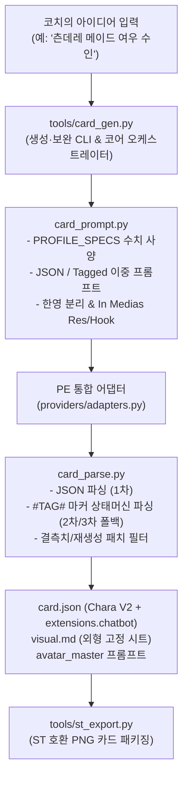

# 캐릭터 생성 시스템 — ST-CardGen 도메인 파이썬 클린 포팅 및 PE 카드 자동 직조

> 방향 (align/D, 2026-10-02): **핵심** — 검증된 ST-CardGen 도메인 아키텍처를 Python stdlib로 1:1 클린 포팅하여, 한 줄 아이디어로 card.json·visual.md를 원클릭 생성하고 결측치 보완 및 부분 재생성을 보장하는 지능형 생성 엔진
> 상태: **active** (2026-10-02 포팅 기조 반영)
> 목적: [ewizza/ST-CardGen](https://github.com/ewizza/ST-CardGen)의 검증된 프롬프트 조립·상세도 통제·이중 파서·외과적 재생성 도메인 로직을 Python stdlib로 1:1 클린 포팅하고, Private Engine(PE) 규격(`visual.md`, `extensions.chatbot`, `state.json`)과 소환 마법사에 완벽히 접목한다.
> 관련: [character-creation-landing.md](character-creation-landing.md)(온보딩 및 소환 마법사 UI) · [character-resource-pipeline.md](character-resource-pipeline.md)(에셋 SSOT 및 규격) · [character-art-manager.md](character-art-manager.md)(그림 도구) · [CONCEPT.md](../CONCEPT.md)

---

## 1. 배경 및 ST-CardGen 코드 레벨 전수 분석

[ewizza/ST-CardGen](https://github.com/ewizza/ST-CardGen)은 SillyTavern(ST) 캐릭터 카드를 로컬에서 생성·편집하는 도구다. 단순 LLM 텍스트 호출을 넘어, 캐릭터 카드의 몰입감과 실용성을 극대화하는 수준 높은 프롬프트 기법과 데이터 처리 방식을 갖추고 있다. 소스 코드 전수 분석을 통해 확인된 5대 핵심 구현 디테일은 다음과 같다.

### 1.1 `domain/character/prompt.ts` (프롬프트 조립 엔진)
* **첫 메시지(`first_mes`) 품질 바 (In Medias Res & Hook)**:
  * 진부한 인사말("안녕?")을 엄격히 배제.
  * 사건 한복판의 감각적 현장 묘사(장소/소리/날씨/조명)와 즉각적인 신체 언어로 시작.
  * 최소 1회 이상의 캐릭터 발화(따옴표 대사) 보장.
  * 유저의 생각이나 행동을 대신 서술하지 않는 **Anti-puppeting** 엄격 준수.
  * 대답을 부르는 **훅(Hook)**(질문, 다급한 요청, 돌발 사건)으로 종료.
* **다국어 엄격 분리**:
  * 카드 본문은 선택 언어(한국어)로 작성하되, `image_prompt`와 `negative_prompt`는 100% 순수 영문으로 강제 분리.
* **이중 포맷 프롬프트 지원**:
  * 표준 JSON 요청(`buildCharacterGenPrompt`) 외에 마커 태그 템플릿(`buildCharacterGenPromptTagged`) 제공.

### 1.2 `domain/character/fieldDetail.ts` (수치 기반 정량적 상세도)
* 모호한 수식어 대신 `PROFILE_SPECS`를 통해 필드별 단어/글자/문단/턴 수를 엄격히 통제:
  * `first_mes`: short(150~240단어, 2~3문단, 최소 700자) / detailed(220~360단어, 3~5문단, 최소 900자) / verbose(360~560단어, 4~6문단, 최소 1200자)
  * `mes_example`: short(1~2쌍), detailed(2~3쌍), verbose(3~5쌍)
  * `tags`: short(4~8개), detailed(6~10개), verbose(8~12개)
* 프롬프트 조립 시 `- first_mes (detailed): 220–360 words, min 900 characters, 3–5 paragraphs. Use \n\n between paragraphs.` 형태로 동적 주입.

### 1.3 `domain/character/parse.ts` (이중 파서 및 폴백 머신)
* **1차 JSON 파싱 (`tryParseJson`)**: 마크다운 블록(````json ... ````) 및 순수 JSON 파싱.
* **2차 태그 섹션 파싱 (`parseTaggedSections`)**: 1차 실패 시 줄 단위 정규식(`^#([A-Z_]+)#$`) 상태 머신으로 파싱. 따옴표 이스케이프(`\"`)나 줄바꿈 깨짐에 완전 면역.
* **실패 분류 (`classifyRawFailure`)**: 잘림(`truncated`), 잘못된 JSON(`invalid_json`), 스키마 불일치(`schema_mismatch`) 진단.

### 1.4 `routes/character.ts` (외과적 결측치 보완 및 재생성 검증)
* **결측치 오염 방지 (`pickMissingKeys` ➔ `filterPatchToMissing`)**:
  * 비어 있는 필드만 추출하여 프롬프트 호출 후, 모델이 다른 필드를 임의로 건드려도 대상 키 외에는 자동 폐기(strip).
* **부분 재생성 실질 변화 검증 루프 (`equalNormalized`)**:
  * 특정 필드 재생성 시 `crypto.randomUUID()`를 `regenNonce`로 주입해 확률 분포를 비틈.
  * 최대 3회 재시도 루프를 돌며 공백/구조 정규화 비교 후 **실제 텍스트 변화(`anyDifferent`)가 있을 때만 채택**.
* **네거티브 프롬프트 토큰 절약**:
  * `useDefaultNegativePrompt`: 뻔한 네거티브 프롬프트 작성을 LLM에 시키지 않고, 앱 기본 프리셋을 서버에서 자동 주입.

### 1.5 `domain/cards/png.ts` (SillyTavern PNG 패키징)
* PNG 청크에서 기존 `chara`/`ccv3` 키워드의 `tEXt` 청크를 제거하고, 새 base64 `chara` 청크를 `IEND` 직전에 삽입.

---

## 2. 포팅 아키텍처 및 PE 접목 설계

바퀴를 다시 발명하지 않고, 검증된 TypeScript 도메인 로직을 Python 3 stdlib 기반으로 1:1 클린 포팅한다.



### 2.1 1:1 포팅 모듈 대응표

| ST-CardGen 원본 | PE 포팅 모듈 | 포팅할 핵심 로직 |
|---|---|---|
| `domain/character/fieldDetail.ts` | `card_prompt.py` | `PROFILE_SPECS` 사양, `build_field_detail_lines()`, 프로필 오버라이드 |
| `domain/character/prompt.ts` | `card_prompt.py` | `build_character_gen_prompt()`, `build_tagged_prompt()`, `build_fill_missing_prompt()`, `build_regenerate_prompt()`, `build_image_prompt()` |
| `domain/character/parse.ts` | `card_parse.py` | `try_parse_json()`, `parse_tagged_sections()`, `classify_raw_failure()`, `build_character_from_tagged()` |
| `routes/character.ts` (도메인부) | `tools/card_gen.py` | `pick_missing_keys()`, `filter_patch_to_missing()`, `filter_patch_to_targets()`, `equal_normalized()`, UUID `regen_nonce` 주입 및 3회 검증 루프 |
| `domain/cards/png.ts` | `tools/st_export.py` | `zlib`/`struct` 기반 PNG `tEXt` 청크 추출 및 `IEND` 직전 base64 `chara` 삽입 |

### 2.2 PE 고유 확장 사항 (ST-CardGen에 없는 부분)
1. **외형 고정 시트(`visual.md`) 동시 생성**:
   * Chara V2의 `description`만으로는 이미지 일관성이 깨지므로, PE의 표준 시각 앵커 규격(`## Style Anchor`, `## Character Anchor`, `## Negative Lock`)을 프롬프트 스키마에 포함하여 생성.
2. **PE 전용 메타데이터 (`extensions.chatbot`)**:
   * `display.user_title`("코치"), `display.voice`(말투), `brains`(work/private 어댑터) 확장 보존.
3. **LLM 어댑터 연동**:
   * 외부 REST fetch 대신 PE 어댑터(`providers/adapters.py`) 또는 세션 러너 경유.
4. **UI 연동**:
   * Vue SPA를 들여오지 않고, 기존 계획된 **소환 마법사(`ccl/D` 모달, 바닐라 JS)**에 깔끔한 1~2개 폼으로 연동.

---

## 3. 범위 및 하지 않는 것

### 3.1 범위
* **`card_prompt.py`**: ST-CardGen `prompt.ts` + `fieldDetail.ts`의 완전한 Python 클린 포팅.
* **`card_parse.py`**: ST-CardGen `parse.ts`의 완전한 Python 클린 포팅 (JSON ➔ Tagged Section 폴백 상태 머신).
* **`tools/card_gen.py`**: 외과적 결측치 채우기 및 `regen_nonce` 기반 실질 변경 검증 CLI & 서비스 모듈.
* **`tools/st_export.py`**: ST 표준 PNG tEXt 청크 내보내기 도구 (`st_import.py`와 양방향 호환).
* **소환 마법사(`ccl/D`) 및 그림 관리자 연동 지점 제공**.

### 3.2 하지 않는 것
* 외부 Node.js / Vue.js 런타임을 호스트에 상주시피지 않는다 (Python stdlib로 완결).
* 복잡한 파라미터 슬라이더를 노출하지 않는다 (PE의 노-가드닝 및 단일 창 원칙 준수).
* 무거운 외부 파이썬 패키지를 추가하지 않는다 (stdlib `re`, `json`, `uuid`, `struct`, `zlib` 활용).

---

## 4. 결정 사항

| D | 항목 | 내용 | 상태 |
|---|---|---|---|
| D1 | 포팅 기조 | ST-CardGen의 검증된 도메인 로직을 Python stdlib로 1:1 클린 포팅하여 바퀴의 재발명을 방지한다 | 채택 |
| D2 | 다국어 분리 원칙 | 카드 본문은 한국어, 아바타/외형 프롬프트는 100% 영문으로 강제 분리 | 채택 |
| D3 | 이중 파싱 폴백 | 로컬/경량 LLM을 고려하여 JSON 실패 시 `#TAG#` 마커 템플릿으로 자동 재시도하는 상태 머신을 기본 탑재한다 | 채택 |
| D4 | PE 규격 동시 생성 | 한 번의 생성 과정에서 `card.json`뿐만 아니라 `visual.md`와 `extensions.chatbot`을 함께 직조한다 | 채택 |
| D5 | ST 카드 규격 | Chara V2 스펙을 기본으로 하며, PE 고유 메타데이터는 `extensions.chatbot`에 보존하여 ST와 PE 양쪽에서 완벽 호환 | 채택 |

---

## 5. 작업 항목

| id | 작업 | 경로 | 수용 기준 | Tier·⚡ | 크기 | 의존 | 티켓 |
|---|---|---|---|---|---|---|---|
| `cgs/A` | 계획 문서 등록 및 포팅 기조 갱신 | `docs/plans/character-generation-system.md`, `docs/plans/INDEX.md` | INDEX 행 등록 및 `test_plans_index` 통과 | 0 · — | S | — | 완료 |
| `cgs/B` | 프롬프트 및 상세도 포팅 모듈 | `card_prompt.py`, `tests/test_card_prompt.py` | `fieldDetail.ts` + `prompt.ts` 1:1 포팅: In medias res, Hook, Anti-puppeting, 수치 상세도 사양, JSON/Tagged 이중 빌더 단위 테스트 통과 | 1 · — | M | `cgs/A` | 완료 |
| `cgs/C` | 이중 파서 및 폴백 모듈 | `card_parse.py`, `tests/test_card_parse.py` | `parse.ts` 1:1 포팅: JSON 파서, Tagged 상태머신 파서, 실패 진단기 단위 테스트 통과 | 1 · — | M | `cgs/B` | 완료 |
| `cgs/D` | 캐릭터 카드 생성 및 보완 도구 | `tools/card_gen.py`, `tests/test_card_gen.py` | `routes/character.ts` 비즈니스 로직 포팅: 아이디어 기반 직조, 결측치 채우기(`--fill-missing`), `regen_nonce` 기반 3회 실질 변경 검증 CLI | 2 · — | M | `cgs/C` | 완료 |
| `cgs/E` | SillyTavern PNG 카드 내보내기 | `tools/st_export.py`, `tests/test_st_export.py` | `cards/png.ts` 포팅: `card.json` + 마스터 이미지를 ST 표준 PNG tEXt 청크로 패키징하고 `st_import.py`로 역검증 통과 | 2 · — | M | — | 완료 |
| `cgs/F` | 소환 마법사(`ccl/D`) 및 UI 연동 | `server.py`, `route_table.py` | 새 캐릭터 생성/재생성 REST 엔드포인트 제공 및 마법사 연동 준비 | 2 · ⚡ | M | `cgs/D`, `ccl/D` | 대기 |
