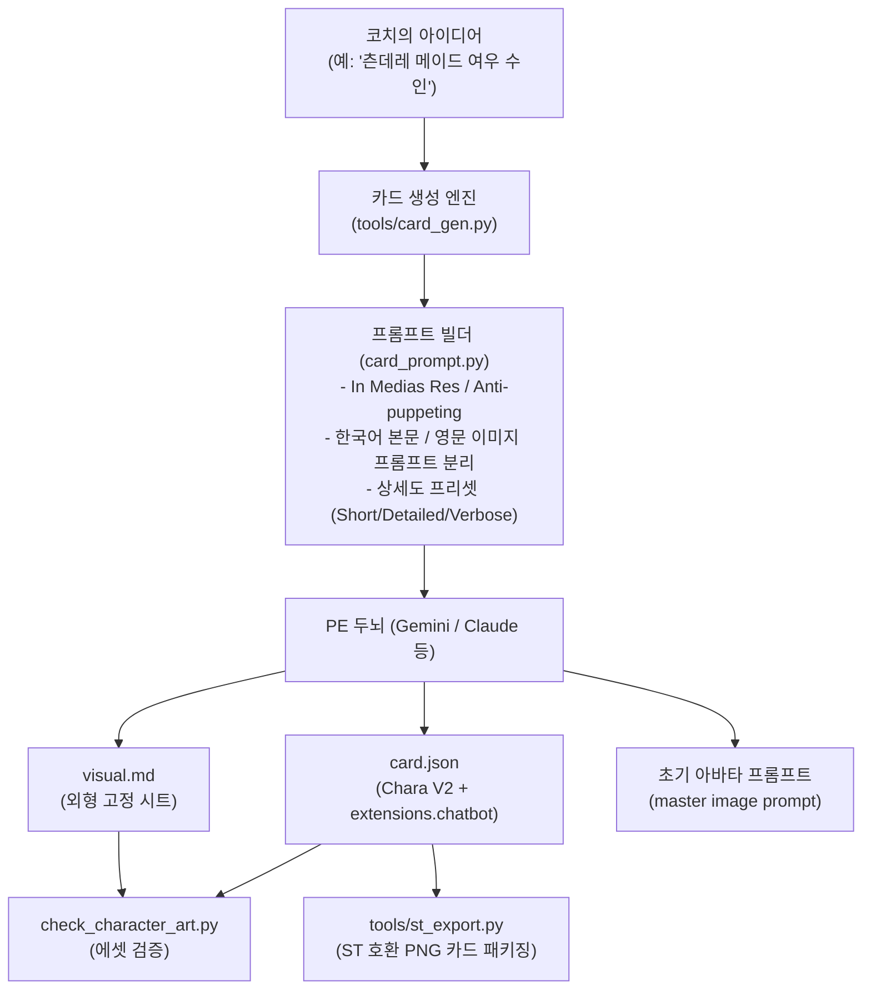

# 캐릭터 생성 시스템 — ST-CardGen 벤치마크 및 고품질 카드 자동 직조

> 방향 (align/D, 2026-10-02): **핵심** — 한 줄 아이디어로 완성도 높은 캐릭터 카드·외형 고정 시트·첫 만남 장면을 원클릭 생성하고 결측치 보완 및 부분 재생성을 지원하는 지능형 생성 엔진
> 상태: **active** (2026-10-02 초안)
> 목적: [ST-CardGen](https://github.com/ewizza/ST-CardGen)의 프롬프트 구조(In medias res, Anti-puppeting, Hook, 필드 상세도 프리셋, 부분 재생성)를 분석·흡수하여, Private Engine(PE) 규격에 완벽히 부합하는 캐릭터 카드(`card.json`)와 시각 고정 시트(`visual.md`)를 자동 직조하는 시스템을 구축한다.
> 관련: [character-creation-landing.md](character-creation-landing.md)(온보딩 및 소환 마법사 UI) · [character-resource-pipeline.md](character-resource-pipeline.md)(에셋 SSOT 및 규격) · [character-art-manager.md](character-art-manager.md)(그림 도구) · [CONCEPT.md](../CONCEPT.md)

---

## 1. 배경 및 ST-CardGen 심층 분석

[ewizza/ST-CardGen](https://github.com/ewizza/ST-CardGen)은 SillyTavern(ST) 캐릭터 카드를 로컬에서 생성·편집하는 도구다. 단순 LLM 호출을 넘어, 캐릭터 카드의 몰입감과 실용성을 극대화하는 수준 높은 프롬프트 기법과 데이터 처리 방식을 갖추고 있다.

### 1.1 핵심 메커니즘 4가지
1. **첫 메시지(`first_mes`) 품질 강제 (In Medias Res & Hook)**
   * **단순 인사 금지**: "안녕?", "반가워" 같은 진부한 인사말(generic openers)을 엄격히 배제.
   * **현장감 묘사 (In medias res)**: 사건/상황의 한복판에서 오감(장소, 소리, 날씨, 빛)과 캐릭터의 즉각적인 행위(Body language, 작은 몸짓)를 지문으로 묘사.
   * **대사 필수 포함**: 최소 1회 이상의 캐릭터 발화(따옴표 대사) 보장.
   * **유저 조종 금지 (Anti-puppeting)**: 유저의 생각이나 행동을 대신 서술하지 않고 유저의 존재만 인지.
   * **응답 유도 훅(Hook)**: 마지막을 질문, 다급한 요청, 돌발 사건으로 끝맺어 유저가 자연스럽게 첫 대답을 하게 유도.
2. **필드 세분화 및 외과적 재생성 (Surgical Regeneration)**
   * **빈 필드 채우기 (`buildMissingFieldsPrompt`)**: 이미 존재하는 필드는 그대로 두고, 누락된 필드만 정밀 생성.
   * **개별 필드 재생성 (`buildRegeneratePrompt`)**: 특정 필드만 바꿀 때, 기존 값과 동일한 출력을 내지 않도록 재생성 난수(`regenNonce`)와 중복 방지 규칙 적용.
   * **필드 상세도 프리셋 (Field Detail Presets)**: `Short`, `Detailed`, `Verbose` 단위로 각 필드의 길이와 구조(문장 수, 토큰 예산) 통제.
3. **캐릭터 카드 ➔ 영문 이미지 프롬프트 추출 (`buildImagePrompt`)**
   * 카드의 외형, 성격, 스타일 힌트를 바탕으로 Stable Diffusion, ComfyUI, Imagen 등 이미지 엔진에 최적화된 영문 포트레이트 프롬프트와 네거티브 프롬프트(SFW/NSFW) 자동 빌드.
   * **언어 엄격 분리**: 카드 본문은 선택 언어(한국어)로 작성하되, 이미지 프롬프트는 무조건 순수 영어로 작성.
4. **SillyTavern 표준 PNG 청크 패키징**
   * PNG 이미지의 `tEXt` 또는 `iTXt` 청크에 `chara` base64 메타데이터를 직접 기록/파싱하여 완벽한 호환성 제공.

---

## 2. Private Engine(PE) 접목 설계

PE는 SillyTavern의 일반적인 텍스트 카드와 달리, **시각 고정 시트(`visual.md`)**, **PE 전용 확장 필드(`extensions.chatbot`)**, **호감도/관계 상태(`state.json`)**를 함께 운용하는 복합 아키텍처를 가진다.

### 2.1 PE 전용 산출물 구조
생성 엔진이 한 번의 요청(또는 마법사 단계)에서 만들어내는 파일:
1. `characters/<id>/card.json`:
   * Chara V2 표준 필드: `name`, `description`, `personality`, `scenario`, `first_mes`, `mes_example`, `creator_notes`, `tags`
   * PE 전용 확장: `extensions.chatbot.display` (`user_title`: "코치", `voice`: 말투), `brains` (work/private 두뇌 설정)
2. `characters/<id>/visual.md`:
   * `## Style Anchor`: 화풍 고정 (애니 선화, 셀 채색)
   * `## Character Anchor`: 얼굴, 눈동자, 머리모양/색, 수인 귀/꼬리, 기본 복장
   * `## Negative Lock`: 왜곡 방지 및 금지 요소
3. 초기 이미지 생성 프롬프트:
   * 마스터 아바타(`avatar_master.png`)를 뽑기 위한 완성형 영문 프롬프트.

---

## 3. 범위 및 하지 않는 것

### 3.1 범위
* **프롬프트 템플릿 모듈 (`card_prompt.py`)**: ST-CardGen의 검증된 프롬프트 규칙(In medias res, Anti-puppeting, Hook, 상세도 프리셋, 한영 언어 분리) 정식 구현.
* **카드 생성 및 부분 보완 CLI (`tools/card_gen.py`)**:
  * `--idea`: 한 줄 설명으로 `card.json` + `visual.md` 원클릭 생성.
  * `--fill-missing`: 빈 칸만 채우기.
  * `--regenerate <field>`: 특정 필드만 새로운 내용으로 다시 뽑기.
* **카드 외형 ➔ 영문 이미지 프롬프트 변환**: `card.json`과 `visual.md`를 결합하여 SD/ComfyUI/Imagen용 프롬프트 생성.
* **SillyTavern PNG 카드 내보내기 (`tools/st_export.py`)**: 기존 `st_import.py`의 역방향으로, PE 캐릭터를 ST 호환 PNG 카드로 추출.
* **소환 마법사(`ccl/D`) 및 그림 도구(`character-art-manager.md`) 연동 지점 제공**.

### 3.2 하지 않는 것
* 외부 Node.js / Vue 서버를 호스트에 상주시피지 않는다 (PE의 Python stdlib/어댑터 생태계로 순수 구현).
* SillyTavern의 수많은 복잡한 슬라이더와 설정 파편화를 UI에 노출하지 않는다 (PE는 노-가드닝과 간결한 선택지 기조 유지).
* 불필요한 의존성(heavy dependency) 추가 없이, 기존 `platform_compat` 및 `characters.py` 기반으로 동작.

---

## 4. 결정 사항

| D | 항목 | 내용 | 상태 |
|---|---|---|---|
| D1 | 생성 엔진 위치 | `tools/card_gen.py` 및 보조 모듈 `card_prompt.py`로 구현하여 CLI와 내부 API 양쪽에서 호출 가능하게 한다 | 권장 (채택 대기) |
| D2 | 다국어 분리 원칙 | 대화 및 캐릭터 본문은 한국어, 이미지 생성 프롬프트 및 네거티브 프롬프트는 100% 영문으로 강제 분리 | 권장 (채택 대기) |
| D3 | ST 카드 규격 | V2 스펙을 기본으로 하며, PE 고유 메타데이터는 `extensions.chatbot`에 보존하여 ST와 PE 양쪽에서 완벽 호환 | 권장 (채택 대기) |
| D4 | 첫 메시지 필수성 | 모든 캐릭터 생성 시 `first_mes`는 ST-CardGen 식 훅(Hook)과 현장감 지문을 기본 탑재하여 온보딩 품질 보장 | 권장 (채택 대기) |

---

## 5. 작업 항목

| id | 작업 | 경로 | 수용 기준 | Tier·⚡ | 크기 | 의존 | 티켓 |
|---|---|---|---|---|---|---|---|
| `cgs/A` | 계획 문서 등록 및 INDEX 반영 | `docs/plans/character-generation-system.md`, `docs/plans/INDEX.md` | INDEX 행 등록 및 `test_plans_index` 통과 | 0 · — | S | — | 대기 |
| `cgs/B` | 캐릭터 생성 프롬프트 모듈 | `card_prompt.py`, `tests/test_card_prompt.py` | In medias res, Hook, Anti-puppeting, 상세도 프리셋, 한영 분리 프롬프트 빌더 단위 테스트 통과 | 1 · — | M | `cgs/A` | 대기 |
| `cgs/C` | 캐릭터 카드 생성 및 보완 도구 | `tools/card_gen.py`, `tests/test_card_gen.py` | 한 줄 아이디어로 `card.json` + `visual.md` 생성, 결측치 채우기(`--fill-missing`), 필드 재생성(`--regenerate`) 동작 검증 | 2 · — | M | `cgs/B` | 대기 |
| `cgs/D` | 아바타 이미지 프롬프트 추출기 | `card_prompt.py`, `tests/test_card_prompt.py` | `card.json`과 `visual.md`로부터 SFW/NSFW 영문 포트레이트 및 네거티브 프롬프트 생성 검증 | 1 · — | S | `cgs/B` | 대기 |
| `cgs/E` | SillyTavern PNG 카드 내보내기 | `tools/st_export.py`, `tests/test_st_export.py` | `card.json` + 아바타 이미지를 ST 표준 PNG tEXt 청크로 패키징하고 `st_import.py`로 역검증 통과 | 2 · — | M | — | 대기 |
| `cgs/F` | 소환 마법사(`ccl/D`) 및 UI 연동 준비 | `server.py`, `route_table.py` | 새 캐릭터 생성/재생성 REST 엔드포인트 제공 및 마법사 연동 준비 | 2 · ⚡ | M | `cgs/C`, `ccl/D` | 대기 |
