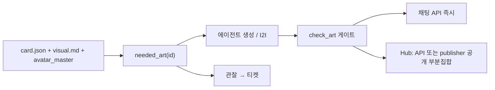

# 캐릭터 파일·리소스 파이프라인

> 방향 (align/D, 2026-09-28): **핵심** — 캐릭터 에셋(외형·스프라이트)은 개인화 레이어이자 프리메이드 기본 팩의 원천. 웹 루트·NAS 경로 서술은 개발 설치 기준

- **상태:** 계획. 착수는 사용자 말로.
- **작성:** 2026-09-26
- **결정:** 사용자, 같은 날 — 캐릭터 생성·수정 시 SSOT가 필요 리소스를 만들고 있어야 할 곳에 둔다. 자기진화 루프와 맞춘다. 코드가 아니라 캐릭터 파일의 집.
- **선행:** `character-art` 스킬, `characters.check_art` (CHARACTER_ART_v1), [multi-agent-worktree-delegation.md](./multi-agent-worktree-delegation.md) §12.4, [user-data-separation.md](./user-data-separation.md), [recursive-self-evolution.md](archive/2026/recursive-self-evolution.md) P1·P3
- **대체하는 절차:** 스킬 `character-pipeline` 6단계의 “웹 루트에 손으로 복사”. 채팅은 이미 캐릭터 폴더 API를 읽는다.

---

## 0. 한눈에

캐릭터 하나 = 폴더 하나 `characters/<id>/`. 그 안에서 파일은 세 종류다. 채팅은 `/api/characters/<id>/avatar|stage`로 이 폴더를 직접 제공한다. 생성은 에이전트(`character-art`), 필요 목록·검증·배포는 호스트.



자기진화는 완결성을 관찰하고 티켓을 연다. 잠긴 마스터를 다시 그리지 않는다.

---

## 1. 이미 있는 것 / 구멍

실측 (2026-09-26).

| 항목 | 상태 |
|---|---|
| 정본 폴더 `characters/<id>/card.json` + `visual.md` + 그림 | 있음. 채팅 선택기·뱃지·스테이지가 `/api/characters/<id>/…`로 읽음 (`server.py` `_character_avatar`) |
| 형식·검사 | `character-art` 스킬, `characters.check_art`, `tools/check_character_art.py` |
| 필요 목록 함수 | **없음.** 빠진 파일은 스킬 문서와 사람이 센다 |
| `data/persona/` (35MB) | 제품 크롬(벤더 아이콘, `bg-studio`)과 옛 냥피디 그림이 한 폴더. git 추적 |
| `/volume1/web/chat/persona/` (52MB) | 레포 밖 복사. Hub FAB가 `/chat/persona/providers/<id>.webp`를 직접 읽음 |
| 파이프라인 스킬 6단계 | 여전히 “웹 루트 동기화”라고 적혀 채팅 코드와 어긋남 |
| git | 승인 webp뿐 아니라 `avatar_master.jpg`, `*_candidate_*`, `_old_avatar_wigs/`까지 추적. `references/`, `private-memory.md`만 ignore |
| 캐릭터 경로 보호 | `protected_paths.json` 밖. 위임 티어 0. 그림은 비용·정체성 때문에 티어 0 자동 랜딩으로 다루지 않음 |
| 사용자 데이터 분리 | [계획](./user-data-separation.md). 캐릭터 폴더는 최종적으로 git 밖 인스턴스 데이터 |

채팅 경로의 복사는 죽은 단계다. Hub와 제품 크롬만 정적 경로가 남는다.

---

## 2. 폴더 안 세 종류

`characters/<id>/` 하나. 종류만 나눈다. 새 최상위 디렉터리를 만들지 않는다.

### 2.1 정본 (덮어쓰기 금지, 운영자 잠금)

| 파일 | 역할 |
|---|---|
| `card.json` | 이름·말투·두뇌 목록. Character Card V2 |
| `visual.md` | 화풍·외형 락·가발 표·거절 목록 |
| `avatar_master.*` | 승인된 얼굴 앵커. 파생은 전부 이 그림에서 I2I |

마스터를 에이전트가 재생성하면 거절한다. 후보만 `gallery/`에 둔다.

### 2.2 파생 (정본에서 다시 만들 수 있음, 앱이 씀)

형식은 CHARACTER_ART_v1 그대로.

| 파일 | 크기 | 필수 |
|---|---|---|
| `avatar.webp` | 512², ≤200KB | 예 |
| `avatar/<provider>.webp` | 512², ≤200KB | `card.json` `brains.work`에 있는 프로바이더마다 **기대**. 없으면 기본 룩으로 폴백 (이미 동작) |
| `stage.webp` | 1024², ≤300KB | 아니오. 없으면 공용 스튜디오 |
| `stage/<provider>.webp` | 1024², ≤300KB | 아니오 |
| `sprites/bust/<label>.webp` | 1024² 투명, ≤400KB | 아니오. 프레이밍이 생기면 `neutral` 필수 |
| `sprites/full/<label>.webp` | 1024×2048 투명, ≤800KB | 아니오 |

표정 이름표는 SillyTavern 세트. 처음 몇 장은 `neutral`, `joy`, `sadness`, `anger`, `surprise`, `embarrassment`. 몸체는 `neutral`에 고정하고 얼굴만 고친다.

### 2.3 인스턴스 (배포·공유 금지)

| 파일 | git | 비고 |
|---|---|---|
| `memory.md` | 분리 전까지 추적 가능 | 업무 기억 |
| `private-memory.md` | 이미 ignore | 사적 세션만 |
| `references/` | 이미 ignore | 공부용, 출고 금지 |
| `gallery/`, `*_candidate_*`, `_old_*` | **ignore로 추가** | 미승인·폐기 |

개인 쌍 로그는 ~/.pe/dialogs에 있고 거기 머문다.

### 2.4 제품 크롬 (캐릭터 파이프라인 밖)

벤더 아이콘 `providers/<id>.webp`, 공용 `bg-studio.webp`, 폴백 `face-icon.webp`는 캐릭터가 아니다. 생성·가발·스프라이트 작업이 여기를 건드리지 않는다. 위치는 구현 때 `static/` 또는 `data/persona/providers/` 중 한곳으로 고정하고, Hub는 그 한곳만 읽는다.

---

## 3. 있어야 할 곳

| 파일 | 런타임 위치 |
|---|---|
| 카드·visual·파생 그림 | `characters/<id>/`만. 채팅은 API |
| 기억 | 같은 폴더. 세션 주입만 |
| Hub FAB 기본 캐릭터 얼굴 | 기본 캐릭터의 `/api/characters/<id>/avatar` **또는** publisher가 찍은 공개 부분집합 한 장 |
| Hub 벤더 아이콘 | 제품 크롬 한곳 |

에이전트가 `data/persona/`와 웹 루트에 같은 webp를 또 넣는 단계는 없다.

`needed_art(cid) -> [{path, kind, reason}]`이 호스트 계약이다. 입력은 `card.json`의 두뇌 목록, `visual.md`의 가발·스프라이트 표, 마스터 mtime, 디스크에 있는 파생. 출력 예: `avatar.webp 없음`, `visual.md`가 `avatar/agy.webp`보다 최신`, `brains`에 `openrouter`가 있는데 가발 없음`.

오래된 파생의 기준은 마스터(있으면) 또는 `visual.md`의 mtime이 파생보다 최신인 경우. 내용 해시까지 이 계획의 1단계에 넣지 않는다.

---

## 4. 생성은 스킬, 배포는 호스트

SillyTavern 카드 V2·표정 이름표는 유지한다. 없는 것은 가발, `visual.md` 락, 생성 게이트, Hub 배포다.

1. 생성/수정이 `card.json`과 `visual.md`를 쓴다. 마스터가 없으면 후보를 `gallery/`에 두고 운영자가 고른 뒤에만 `avatar_master`로 승격한다.
2. 호스트가 `needed_art`로 빈칸·오래된 칸을 계산한다.
3. 에이전트가 그 칸만 그린다. 얼굴은 마스터 I2I, 가발은 머리색·컷·옷만.
4. `check_art`가 게이트. 실패면 그 파일을 출고하지 않는다.
5. 채팅은 API로 바로 보인다. Hub가 정적 경로를 쓰는 동안만 publisher가 공개 부분집합을 찍는다.

스킬 `character-art`는 그리기 규칙만 남긴다. “웹 루트에 복사” 문장은 뺀다. `character-pipeline`은 이 문서의 절차를 가리키고, 6단계를 publisher 호출(또는 “채팅은 복사 없음”)으로 고친다.

---

## 5. 자기진화와의 연결

캐릭터 파일은 코어가 아니라 **인스턴스 층**이다 (`recursive-self-evolution` P1·P3). 관찰·티켓·승인 루프는 쓰고, git worktree 병합은 캐릭터 바이너리의 최종 집이 아니다. `user-data-separation`이 끝나면 병합 계약은 git diff가 아니라 `check_art` + 마스터 승인이다.

| 신호 | 동작 |
|---|---|
| 필수 그림 없음 (`avatar.webp`, `visual.md`) | 관찰 → 티켓 “캐릭터 X 완결” |
| 마스터/`visual.md`가 파생보다 최신 | 같은 티켓. 오래된 파생만 재생성 |
| `brains`에 프로바이더가 늘었는데 가발 없음 | `needed_art`에 한 장 |
| 카드의 이름·호칭 변경 | 텍스트 표면만 (별도, 관찰 0065). 그림과 분리 |
| 승인된 마스터를 덮음 | 관찰 + 거절 |

자율 진화가 하지 않는 일: 잠긴 마스터 재생성, 운영자 승인 없는 이미지 API 호출, 웹 루트 수동 복사.

게이트는 둘이다.

- **규격:** `check_art` (이미 있음)
- **정체성:** 운영자의 마스터 승인. 캐릭터 경로는 보호 목록 밖이라 위임 티어는 0이지만, 그림 생성은 티어 0 자동 랜딩이 아니다. 티켓은 열고, 마스터 승인은 사람이 한다.

관찰 신호(`observation_signals.json`)에 “캐릭터 완결성”을 넣는 것은 Phase 2. 1단계는 `needed_art` + `check_art`를 doctor/도구가 호출할 수 있게만 한다.

위임: 카드·visual 텍스트 수정은 기존 worktree로 충분하다. 바이너리 생성은 Imagine 도구가 있는 세션이 직접 한다 (PD 직접 예외: 워커가 그 도구를 못 가짐). 생성된 파일은 캐릭터 폴더에 두고 `check_art`로 확인한다.

---

## 6. git (분리 전까지)

`user-data-separation` 착수 전까지 최소만 고친다.

**추적:** `card.json`, `visual.md`, 출고하는 파생 `.webp`

**ignore 추가:**

```
data/workspace/characters/*/gallery/
data/workspace/characters/*/*_candidate_*
data/workspace/characters/*/_old_*/
data/workspace/characters/*/avatar_master.*
data/workspace/characters/*/avatar_preview.*
data/workspace/characters/*/avatar_joy.*
```

마스터를 ignore하면 이 머신의 정본은 디스크에만 남는다. 백업은 인스턴스 데이터 백업 쪽에 맡긴다 (분리 계획 §4). 마스터를 저장소에 남기고 싶으면 이 ignore 한 줄만 빼면 된다 — 열린 질문 Q1.

이미 git에 있는 후보·옛 가발은 1단계 착수 때 `git rm --cached`로 추적만 끊는다. 디스크 파일은 유지.

---

## 7. Hub

Hub `index.html`은 `/chat/persona/providers/<id>.webp`를 FAB 아이콘으로 쓴다. 이건 캐릭터 가발이 아니라 벤더 크롬이다.

선택 (구현 때 하나):

- **H1.** Hub FAB도 챗봇 API의 기본 캐릭터 아바타를 읽는다. 복사 없음.
- **H2.** `characters.publish_public(cid)`가 공개 부분집합(기본 아바타 한 장 + 제품 크롬)만 웹 루트에 찍는다. 에이전트가 손으로 복사하지 않는다.

추천은 H1 (채팅과 같은 SSOT). Hub가 챗봇 프로세스 없이 떠 있어야 하면 H2.

`data/persona/`의 옛 캐릭터 그림·gallery는 1단계 이후 읽지 않는다. 삭제는 운영자가 한 번 확인한 뒤.

---

## 8. 단계 (PR)

각 단계는 독립적으로 머지 가능. 그림 생성 자체는 이 PR들에 넣지 않는다 — 형식과 호스트 계약만.

### PR 1 — 필요 목록과 스킬 정합 (Tier 1, 호스트 모듈이면 ⚡)

- `characters.needed_art(cid, providers)` + 테스트
- `check_art`는 그대로 게이트
- `.gitignore`에 §6 패턴
- 스킬 `character-art`·`character-pipeline`에서 웹 루트 수동 복사 문장 삭제, 이 계획서를 가리킴
- `docs/plans/INDEX.md`는 이 문서가 이미 한 줄

대상: `characters.py`, `tests/test_character_art.py`, `.gitignore`, 스킬 두 개, 스킬 `character-pipeline`(`data/workspace/.agents/skills/character-pipeline/SKILL.md`, 정본)

### PR 2 — 관찰 신호 (Tier 1)

- doctor 또는 `needed_art`를 도는 작은 검사: 필수 파일 없는 캐릭터를 관찰 후보로
- 마스터 덮어쓰기 감지는 나중에

대상: `evolution.py` 신호 또는 `workspace_status` 한 줄. `observation_signals.json`을 건드리면 Tier 3 → 이 PR에서 빼고 승인 티켓으로만.

### PR 3 — Hub 정적 경로 (Tier 0 정적 또는 Hub 파일)

- H1 또는 H2 중 사용자가 고른 쪽
- 제품 크롬 경로 한곳 고정

### PR 4 — 사용자 데이터 분리와 합류

- [user-data-separation.md](./user-data-separation.md)가 착수되면 `characters/` 전체를 인스턴스 데이터로 옮긴다
- 그때 캐릭터 작업의 게이트는 git merge가 아니라 `check_art` + 마스터 승인

---

## 9. 열린 질문

착수 전에 받을 것.

- **Q1.** `avatar_master.*`를 git ignore 할까, 이 저장소에 남길까.
- **Q2.** Hub는 H1(API)인가 H2(publisher)인가.
- **Q3.** 가발을 `brains`에 있는 프로바이더만 기대할 것인가, 어댑터 목록 전체인가. 지금은 카드에 `grok`만 있는 캐릭터도 가발 6장이 있다.

---

## 10. 무대·스프라이트 사양과 대체 사슬 (2026-09-29 운영자)

운영자: "스테이지 배경 + 알파 적용된 캐릭터를 기본 배경 사양으로" → "캐릭터당 스프라이트 목록을 정하고, 리소스가 없을 때 어떤 리소스로 fallback 될지 정하면 좋겠어. 최종 fallback은 placeholder."

### 10.1 지금 사실 (2026-09-29 확인)

| 캐릭터 | `stage.webp` | 스프라이트 | 화면 |
|---|---|---|---|
| 리리 | 인물이 그려짐 | 없음 | 무대 = 큰 캐릭터 |
| 노노 | 인물이 그려짐 | bust 4종(neutral·joy·embarrassment·anger) | 캐릭터가 **두 번** (무대 + 오른쪽 아래 스프라이트) |
| 코코 | 장소만 | 없음 | 정상 |
| Yae Miko | 장소만 | 없음 | 정상 |

- 원인: 스킬 `character-art`가 무대를 "그 두뇌 배지와 같은 얼굴·가발"로 그리라고 지시한다.
- 표정 어휘가 세 벌이다(10.4에서 하나로): 모델 지시 `neutral|joy|shy|serious|sorrow|tired`(`private_engine.py`), 감정 파서 `happy|sad|angry|…`(`emotion.py`), 스프라이트 파일 SillyTavern 이름표(`characters.EXPRESSIONS` 28개). 모델이 `shy`라고 해도 `embarrassment` 스프라이트를 못 찾고 `neutral`로 떨어진다.

### 10.2 무대 = 장소, 캐릭터 = 투명 스프라이트

- `stage.webp`: **인물 없는 장소**. 1024², ≤300KB. 캐릭터와 무관하게 여러 캐릭터가 같이 써도 된다.
- 캐릭터는 `sprites/<framing>/<label>.webp`(투명)로만 무대에 선다. 두뇌별 가발 차이는 무대가 아니라 스프라이트로(`sprites/<framing>/<brain>/<label>.webp`, 선택).
- `stage/<provider>.webp`는 읽기 호환만 두고 새로 만들지 않는다(장소는 두뇌와 무관).

### 10.3 차용하는 커뮤니티 표준 (2026-09-29 원문 확인)

운영자: "리소스 목록은 커뮤니티 스탠다드 같은 게 있으면 차용하는 게 좋아". 새 형식을 만들지 않는다.

| 표준 | 정한 것 | 우리가 쓰는 곳 | 출처 |
|---|---|---|---|
| SillyTavern 표정 이미지 | 표정 이름 = 분류 모델의 이름표. 기본 28개(go_emotions), 작은 모델은 6개(`sadness` `joy` `love` `anger` `fear` `surprise`). 캐릭터 폴더에 `<표정>.png` 평평하게. 한 표정 여러 장은 **`joy-1.png`, `joy.expressive.png`처럼 표정 이름 + `.`/`-` 접미사**. 없는 표정은 설정한 대체 표정(보통 `neutral`), 또는 없음, 또는 기본 이모지. **폴더 덮어쓰기**로 같은 캐릭터의 다른 세트(의상 등) | 표정 이름·파일 이름·대체·두뇌별 가발 폴더 | [Expression Images](https://docs.sillytavern.app/extensions/expression-images/) |
| Character Card V3 `assets` | 그림 종류 `icon`(대표 `main`), `background`(대표 `main`, 이름은 장소 `forest`…), `emotion`(이름 = 표정, 기본은 `neutral`), `user_icon`, 앱 전용은 `x_` 접두. CHARX(zip) 안 위치 `assets/{type}/images/` | 종류 이름·내보내기/가져오기 형식 | [SPEC_V3.md](https://github.com/kwaroran/character-card-spec-v3/blob/main/SPEC_V3.md) |

### 10.4 이름이 곧 대체 사슬 (별도 데이터 없음)

운영자: "따로 데이터 구조 만들지 않고 네이밍으로 자동 fallback". 규칙은 SillyTavern의 여러 장 규칙을 그대로 뒤집어 쓴다:

> 이름의 마지막 `.`/`-` 접미사를 **하나씩 떼며** 파일을 찾는다. 다 떼면 그 종류의 기본 이름(`neutral` / `main`), 그것도 없으면 placeholder.

- 표정: `joy.giggle` → `joy` → `neutral` → placeholder `sprite-<framing>`. `joy-1`·`joy-2`처럼 같은 표정 여러 장이 있으면 SillyTavern처럼 그중 하나.
- 두뇌별 가발 = SillyTavern의 폴더 덮어쓰기: `sprites/bust/grok/joy.webp` → `sprites/bust/joy.webp`.
- 다른 종류도 같은 규칙: 아이콘 `avatar/grok` → `avatar` → placeholder, 배경 `stage.night` → `stage` → placeholder, 아이템 `items/<id>` → placeholder `item`.
- 옛 이름(`shy`·`sorrow`·`serious`·`tired`)은 표준 이름이 아니다. 모델에게 표준 이름만 알려 주면(아래) 별칭 표가 필요 없다.

### 10.5 캐릭터당 스프라이트 목록 = 그 폴더의 파일 이름

- 목록을 따로 적지 않는다. `sprites/<framing>/`의 이름이 그 캐릭터의 표정 목록이다(`sprite_map`).
- **모델에게는 그 캐릭터가 가진 표정 이름을 알려 준다**(없으면 `neutral`만). 모델 어휘와 파일이 어긋날 수 없다. 지금의 세 벌 어휘(모델 지시·`emotion.py`·페이지 이모지)는 이것으로 대체: 파서는 `[expression: <이름>]`을 그대로 받고, 페이지 이모지는 아는 이름만, 모르면 🎭.
- 필수는 `neutral` 하나. 새 캐릭터 권장 세트 = SillyTavern 6개 + `neutral`(SD1). 전부 그리면 28개.
- 프레이밍은 `bust` 우선, `full` 선택. 요청한 프레이밍에 없으면 다른 프레이밍에서 같은 사슬.

### 10.6 판정은 서버 한 곳

`characters.art_file(cid, kind, name, framing, brain)` 하나가 10.4 규칙으로 파일을 고르고, 모든 끝은 placeholder다. 페이지는 받은 그림을 그리기만 한다. 규칙이 코드 한 함수라 테스트로 사슬 전체를 확인한다.

### 10.7 결정 (운영자 확인 필요)

| D | 질문 | 추천 | 상태 |
|---|---|---|---|
| SD1 | 새 캐릭터 권장 표정(스킬이 그리는 목록) | SillyTavern 6개(`sadness` `joy` `love` `anger` `fear` `surprise`) + `neutral`. 데이터가 아니라 스킬 문장 | **결정** (2026-09-29 운영자: 추천대로) |
| SD2 | 스프라이트가 하나도 없는 캐릭터의 무대 | 운영자 말대로 placeholder 실루엣. 대안: 무대에 아무도 세우지 않음(말풍선 프로필 그림만) | **결정** (2026-09-29 운영자: 추천대로) |
| SD3 | 스프라이트 배치 | 비주얼노벨식 — 높이 약 90%, 가운데보다 약간 오른쪽, 말풍선 유리 뒤. 지금은 오른쪽 아래 45%×70% | **결정** (2026-09-29 운영자: 추천대로) |
| SD4 | 리리·노노의 인물 든 무대 | 새 장소 그림이 올 때까지 `_old/`로 옮기고 placeholder 무대. 새 그림은 `character-art` 에이전트가 10.2 사양으로 | **결정** (2026-09-29 운영자: 추천대로) |

### 10.8 항목

| id | 작업 | paths(변경) | 수용 기준 | tier·⚡ | 크기 | 의존 | 티켓 |
|---|---|---|---|---|---|---|---|
| `crp/S1` | 이 절 | 이 문서 | 커밋 | 0 · — | S | — | ✅ #369 |
| `crp/S2` | 이름 사슬 판정 | `characters.py`(`art_file`), 테스트 | 10.4 규칙(접미사 떼기·폴더 떼기·같은 표정 여러 장·다른 프레이밍·placeholder)을 테스트가 확인, 데이터 파일 없음 | 1 · ⚡ | M | — | ✅ #373 |
| `crp/S3` | 모델에게 그 캐릭터의 표정 이름을 | `private_engine.py`, `emotion.py`, `static/markdown.js`, 테스트 | 지시 문장의 이름 = 폴더의 이름(+`neutral`), 파서가 임의 이름을 받음 | 1 · ⚡ | S | crp/S2 | 대기 |
| `crp/S4` | 사양 문서화: 스킬 `character-art`·`characters.py` 주석을 10.2–10.5로, 가져오기·내보내기는 CCv3 `assets` 이름 | 스킬, `characters.py` | "무대에 인물 금지" 문장, 두뇌별 차이는 스프라이트로 | 1 · — | S | — | 대기 |
| `crp/S5` | 스프라이트 배치 | `static/`(스프라이트 층) | SD3대로, 모바일·데스크톱 | 1 · — | S | SD3 | 대기 |
| `crp/S6` | 리리·노노 무대 정리 | 캐릭터 폴더(운영자 데이터) | SD4대로 | 운영자 | S | SD4 | 대기 |
| `crp/D1` | 동료 dm은 ~/.pe/dialogs에 둔다 | `dialog_log.py`, 테스트 | 개인 쌍 로그는 ~/.pe/dialogs에 있고 거기 머문다 | 1 · ⚡ | S | — | ✅ #599 |

---

## Key Decisions

1. **정본은 캐릭터 폴더 하나.** 채팅은 이미 API로 읽는다. 같은 그림의 두 번째·세 번째 복사본을 파이프라인에 두지 않는다.
2. **파일은 정본 / 파생 / 인스턴스.** 제품 크롬은 캐릭터 파이프라인 밖.
3. **`needed_art`가 호스트 계약.** 스킬은 그리기만. 배포는 호스트.
4. **자기진화는 완결성을 관찰한다.** 그림을 그리지 않고, 마스터를 덮지 않는다. 마스터 승인은 사람.
5. **git은 출고 webp + 카드 + visual만** (분리 전까지). 후보·옛 가발·(Q1에 따라) 마스터는 ignore.
6. **SillyTavern 카드 V2와 표정 이름표는 유지.** 새로 만드는 형식은 가발·락·게이트뿐이다.

---

## PR Plan

| 순서 | 제목 | 파일 | 의존 |
|---|---|---|---|
| 1 | `needed_art` + ignore + 스킬 정합 | `characters.py`, 테스트, `.gitignore`, 스킬 2, 스킬 `character-pipeline` | 없음 |
| 2 | 캐릭터 완결성 관찰 | doctor/status 쪽, 신호는 승인 티켓 있을 때만 | 1 |
| 3 | Hub 경로 단일화 | Hub `index.html` 또는 얇은 publisher | Q2 |
| 4 | 인스턴스 데이터로 이전 | `user-data-separation`과 같이 | 그 계획 착수 |
