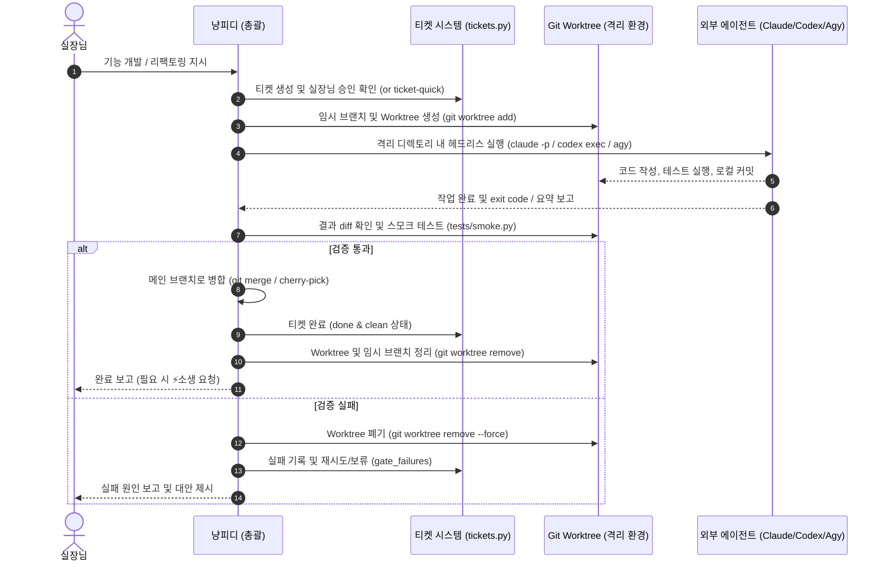

# 멀티 에이전트 Git Worktree 격리 외주 계획서 (Multi-Agent Worktree Delegation)

- **작성일:** 2026-09-23
- **상태:** 계획 (Proposed)
- **대상:** `services/chatbot/`, `~/bin/`, `~/tools/`

---

## 1. 배경 및 목적

### 1.1 배경
- 현재 냥피디는 단일 런타임 호스트(`server.py`) 위에서 실장님의 질의 응답, NAS 운영, 자기수정을 단일 컨텍스트로 처리하고 있다.
- 복잡한 코드 리팩토링이나 심층 조사, 다단계 기능 개발을 단일 대화 컨텍스트에서 수행하면 **컨텍스트 팽창, 토큰 소모 극대화, 세션 지연**이 발생한다.
- 호스트에는 이미 최고 수준의 코딩 CLI들(`claude`, `codex`, `agy`, `grok`)이 설치되어 비대화형/헤드리스 실행을 완벽하게 지원하고 있다.
- 특히 **Claude Code(`claude`)의 백그라운드 에이전트 및 Git 기반 분기 모델**과, 냥피디가 기보유한 **재귀적 자기진화 거버넌스(`tickets.py`의 근거·승인·리스·검증 계약)**는 본질적으로 동일한 "호스트 무중단 격리 안전성"을 지향한다.

### 1.2 목적
- 냥피디를 **"총괄 프로듀서 / 오케스트레이터"**로 두고, 세부 구현·검증·심층 리서치를 **독립된 Git Worktree 격리 환경**에서 외부 CLI 서브에이전트에게 외주(`delegate`)를 주는 파이프라인을 구축한다.
- 라이브 호스트와 작업 디렉토리가 오염되지 않도록 완벽히 격리하며, 작업 결과물은 Git 커밋 및 diff 단위로 검증 후 메인 브랜치에 안전하게 병합한다.

---

## 2. 핵심 아키텍처 및 원칙

### 2.1 3대 철학 (See1 & Ponytail 원칙)
1. **SSOT & 최소 토큰 (Zero Bloat):**
   - 불필요한 데몬이나 무거운 외부 오케스트레이터를 신설하지 않는다.
   - 이미 검증된 Linux 표준 도구(`git worktree`, `bash`, `subprocess`)와 기존 티켓 시스템(`tickets.py`, `ticket-quick`)을 최대한 재활용한다.
2. **호스트 불변성 (Host Immunity):**
   - 외주 작업 중 외부 CLI가 실수를 하거나 비정상 종료되더라도 라이브 냥피디 호스트는 털끝 하나 다치지 않는다.
   - 모든 수정 작업은 임시 Worktree 디렉토리 내에서만 일어나며, 실패 시 Worktree 삭제(`git worktree remove`)만으로 원상복구된다.
3. **티켓 기반 거버넌스 (Evidence & Approval):**
   - 코드를 건드리는 모든 외주 작업은 헌장에 따라 승인된 티켓과 유효한 리스(Lease)를 바탕으로 실행된다.

---

## 3. 작업 라이프사이클 (Worktree Delegation Flow)



---

## 4. 세부 구성 요소

### 4.1 Git Worktree 헬퍼 (`~/bin/worktree-runner` or Python 헬퍼)
- **경로 규칙:** `~/.worktrees/<ticket-id>/` 또는 `/volume1/homes/me/tmp-worktrees/<ticket-id>/`
- **명령 규격:**
  ```bash
  # 1. 생성 및 격리 환경 진입
  git worktree add -b "feat/ticket-<ID>" ~/.worktrees/<ID> HEAD
  
  # 2. 외부 CLI 호출 (예: Claude Code 헤드리스)
  cd ~/.worktrees/<ID> && claude -p "지시문..."
  
  # 3. 완료 후 브랜치 병합 및 정리
  git checkout main && git merge "feat/ticket-<ID>"
  git worktree remove ~/.worktrees/<ID>
  git branch -d "feat/ticket-<ID>"
  ```

### 4.2 제공자별 에이전트 실행 프로파일 (`adapters.py` 연계)
- **`claude` (Claude Code):**
  - 대규모 리팩토링, 복잡한 파이썬 모듈 구조화에 최적.
  - 실행 형태: `claude -p "<prompt>"` 또는 `claude --bg` 후 감시.
- **`codex` (Codex CLI):**
  - 빠른 스크립트 작성, 단일 파일 버그 패치, 단위 테스트 생성에 최적.
  - 실행 형태: `codex exec "<prompt>"`.
- **`agy` (Antigravity CLI):**
  - NAS MCP 및 고유 스킬 시스템과의 연동 작업에 최적.
  - 실행 형태: `invoke_subagent` 네이티브(share/branch 모드) 또는 `agy exec`.
- **`grok` (Grok CLI):**
  - 최신 웹 트렌드 조사, 크리에이티브 콘텐츠 초안 작성에 최적.

### 4.3 냥피디 MCP 인터페이스 (`delegate_task`)
- 냥피디가 런타임에서 호출할 도구 스펙:
  ```json
  {
    "name": "delegate_task",
    "description": "외부 CLI 에이전트에게 Git Worktree 격리 환경에서 작업을 위임하고 결과를 취합합니다.",
    "parameters": {
      "provider": "claude | codex | agy | grok",
      "instruction": "수행할 작업의 구체적인 프롬프트",
      "target_paths": ["services/chatbot/foo.py"],
      "ticket_id": 123
    }
  }
  ```

---

## 5. 단계별 실행 계획 및 현황 (Milestones & Status)

- **[마일스톤 1] Worktree 격리 실행 헬퍼 스크립트 PoC (완료 - 2026-09-23)**
  - 스크립트 구현: `tools/worktree_runner.py`
  - 검증 완료:
    - `codex` 헤드리스 실행 및 임시 격리 worktree 테스트 성공 (무오염 정리 확인).
    - `claude` (`claude -p --dangerously-skip-permissions`) 헤드리스 격리 테스트 성공 (10.08s 완료, worktree 내 파일 생성 및 메인 리포 완전 격리 검증).
- **[마일스톤 2] 티켓 연동 및 검증 게이트 결합 (구현 - 2026-09-23, claude-code)**
  - `tools/worktree_runner.py run`: `ticket-quick start` → `~/.worktrees/chatbot/ticket-<ID>` (브랜치 `worktree/ticket-<ID>`) → 에이전트 헤드리스 실행 → 게이트 → `git merge --ff-only` → `ticket-quick done` → 정리. `cleanup --ticket N`은 남은 worktree/브랜치 제거.
  - 게이트 순서: 커밋 존재(미커밋 변경은 러너가 제공자 author로 대신 커밋) → 범위(`--paths` 밖 변경 = gate_failed) → 리스 연장 → 메인이 움직였으면 rebase(충돌 = gate_failed) → `DEFAULT_GATES`(smoke + provider/name 중립성 가드) + `--gate` 명령들.
  - 실패: 병합 없음 → `ticket-quick fail --outcome gate_failed|failed` (티켓에 사유 노트, 시도 예산 차감) → worktree 폐기(`--keep`이면 보존).
  - `ticket-quick`에 `fail`, `renew` 서브커맨드 추가. 커밋 author는 제공자 레지스트리(`PROVIDERS`)의 신원으로 고정.
  - 에이전트 타임아웃은 작성자 리스(1800s) 안쪽으로 제한(최대 1500s). 라이브 호스트는 재시작하지 않는다.
  - 테스트: `tests/test_worktree_runner.py` (임시 리포 + 가짜 에이전트 + 가짜 ticket-quick, 8건). 실제 CLI로 도는 end-to-end 실행은 아직 안 했다.
- **[마일스톤 3] 냥피디 MCP 도구 배선 (`delegate_task`)**
  - 냥피디가 대화 중 직접 판단하여 외부 에이전트에게 작업을 분배할 수 있도록 도구 등록.
- **[마일스톤 4] 다중 에이전트 토론/교차 검증 (Dual Loop)**
  - A 에이전트(코드 작성: Codex/Claude) -> B 에이전트(코드 리뷰: Claude/Agy) -> 냥피디 취합 보고.

---

## 6. Claude Code 인수인계 안내 (Handover for Claude Code)

### 6.1 현재 기준 상황
1. **PoC 스크립트 검증 완료**: `tools/worktree_runner.py`가 구현되어 있으며 `codex`와 `claude` 헤드리스 격리 생성이 정상 동작함을 실측했습니다.
2. **리포지토리 상태**: `services/chatbot` 메인 리포지토리는 깨끗한 상태(clean)입니다.

### 6.2 마일스톤 2 개발 목표
`tools/worktree_runner.py`를 고도화하거나 상위 래퍼를 구성하여 다음 라이프사이클을 완성해주세요:
1. **티켓 발급 & 클레임 연동**:
   - `~/bin/ticket-quick start --title "<제목>" --paths "<수정대상경로>"` 호출하여 `TICKET_ID`, `CLAIM_TOKEN` 획득.
   - 발급된 `TICKET_ID` 기반 브랜치(`worktree/ticket-<ID>`)로 worktree 생성.
2. **에이전트 헤드리스 실행 및 커밋 요구**:
   - 격리 환경에서 대상 에이전트(Claude 등)가 코드를 수정하고 브랜치 내에 commit을 남기도록 지시/처리.
3. **검증 게이트 (Verification Gate)**:
   - worktree 환경(또는 메인 스테이징 전)에서 `python3 tests/smoke.py` 실행.
   - 테스트 통과 시: 메인 브랜치로 merge (`git merge --ff-only` 또는 일반 merge) -> `~/bin/ticket-quick done --id <ID> --token <TOKEN>` 실행 -> worktree 정리.
   - 테스트 실패 시: merge 중단 -> worktree 정리 및 티켓 실패/에러 보고.
4. **주의사항**:
   - 헌장 규칙 준수: 티켓 대상 경로 커밋 상태 확인 및 무중단 유지.
   - 불필요한 의존성 없이 표준 라이브러리(`subprocess`, `pathlib` 등) 중심의 깔끔한 구현 유지.

---

## 7. 재평가 (2026-09-23, 마일스톤 2 구현 후)

PoC 이후 코드와 거버넌스를 대조해 보고 나온 점. 마일스톤 3 전에 결정이 필요한 순서대로.

1. **worktree는 파일시스템 격리가 아니다.** git 상태만 분리된다. `--dangerously-skip-permissions`로 도는 에이전트는 같은 사용자(`me`)로 메인 리포, `~/bin`, `data/secrets.env` 읽기, 서비스 재시작, `git push`까지 다 할 수 있다. 2.1-2의 "호스트 불변성"은 현재 프롬프트 지시와 범위 게이트(사후 검출)에 의존한다. 실제 격리가 필요하면 제공자 샌드박스(codex `-s workspace-write`, agy `--sandbox`, claude sandbox 설정)나 별도 사용자/컨테이너가 필요하다. 러너가 부모 환경변수를 그대로 넘기므로, 서버 안에서 부를 마일스톤 3에서는 환경변수를 허용 목록으로 걸러야 한다(API 키 유출 방지).
2. **승인 우회 문제.** `ticket-quick start`는 제안과 동시에 `operator (api)`로 승인한다. 사용자가 CLI로 직접 지시한 경우엔 맞지만, 마일스톤 3에서 chat-agent가 스스로 `delegate_task`를 부르면 "승인된 티켓만 실행"(2.1-3) 원칙을 스스로 뚫는다. `delegate_task`는 이미 사용자가 승인한(`approved`) 티켓 번호만 받고 claim만 하도록 해야 한다.
3. **작성자 리스가 호스트 전체에 하나다.** `tickets.py`의 `author.lease`는 전역 1개라서 외주가 도는 동안(최대 25분) 다른 티켓 작업, 즉 chat-agent 자신의 자기수정도 막힌다. 병렬 외주나 마일스톤 4의 동시 실행은 현 거버넌스로 불가능하다. 병렬이 목표라면 리스를 티켓(또는 경로 집합) 단위로 바꾸는 것이 선행 과제다.
4. **자동 병합 + 재시작 시 자동 반영.** 게이트를 통과하면 사람 리뷰 없이 main에 들어가고, 다음 `repair`나 워치독 재기동 때 라이브에 올라간다. 게이트는 smoke(7건)와 중립성 가드뿐이다. 선택지: (a) 경로별 관련 테스트를 자동으로 게이트에 추가(`foo.py` → `tests/test_foo.py`), (b) 병합 전 사용자 확인 모드(브랜치를 남기고 diff 요약만 보고).
5. **동기 실행.** `claude -p` 작업은 수 분에서 수십 분이 걸린다. 대화 턴 안에서 동기로 부르면 턴이 묶인다. 마일스톤 3은 백그라운드 실행 + 결과 파일/티켓 노트로 완료를 알리는 비동기 구조여야 한다.
6. **마일스톤 4(교차 검증)는 별도 단계보다 게이트 한 종류로 두는 편이 싸다.** 리뷰 에이전트가 `git diff base..HEAD`를 읽고 통과/탈락만 exit code로 돌려주면 `--gate`에 그대로 끼워진다.
7. **4.2 제공자 프로파일의 "최적" 분류는 실측 근거가 없다.** 명령 형태도 틀린 곳이 있었다(`agy exec` 없음 → `agy -p`). 러너의 `PROVIDERS`가 실제 명령의 SSOT다.
