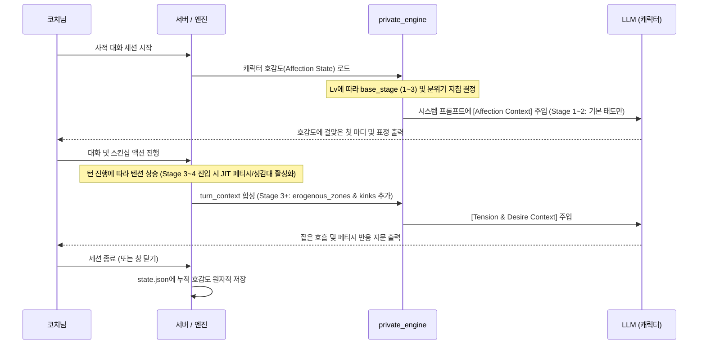

# 프라이빗 모드 영구 호감도(Affection) 시스템 설계서

> 상태: **계획** (2026-09-25)  
> 선행 문서: [private-tension-escalation.md](private-tension-escalation.md), [private-action-interaction.md](private-action-interaction.md)  
> 목적: 세션 내 단기 긴장도(Tension 1~4)를 넘어, 세션을 거듭하며 누적되는 캐릭터별 영구적 유대감 및 호감도(Affection) 체계 구축

---

## 1. 배경 및 문제 정의

- **현재 한계**:
  - `private_engine.py`의 텐션 엔진은 세션 안에서 4단계(`1: 도입` -> `2: 고조` -> `3: 밀착` -> `4: 절정`)로 올라가지만, **새 세션을 시작하면 다시 1단계(도입)로 초기화**됨.
  - `private-memory.md`에 사적 대화 요약이 축적되기는 하나 텍스트 형태일 뿐, 캐릭터의 태도·기본 친밀도·스킨십 허용 한계선에 정량적인 영향을 주지 못함.
  - 코치님과의 깊은 대화나 교감이 다음 세션의 첫인상이나 기본 텐션으로 이어지지 않아 '처음 만난 것처럼 조심스러워지는' 괴리 발생.
- **해결 목표**:
  - 캐릭터별 **영구 호감도(Affection)** 상태를 영구 저장.
  - 호감도 레벨에 따라 **첫 인사 톤, 기본 시작 텐션(Stage), 속마음 개방도, 특별 상호작용**이 자연스럽게 해금.
  - 과도한 게임식 노가다나 복잡성을 배제하고, 자연스러운 대화/교감만으로 점진 성장하는 미니멀한 설계.

---

## 2. 호감도 등급 및 단계 정의 (5-Tier)

| 레벨 (Lv) | 호칭 / 관계 | 기본 시작 텐션 | 캐릭터의 심리 및 반응 특징 | 해금 요소 |
|---|---|---|---|---|
| **Lv 1** | **어색한 동료** (0~19pt) | Stage 1 (도입) | 정중함, 사적인 터치에 깜짝 놀람/경계, 방어적 속마음 | 기본 일상/업무 대화 |
| **Lv 2** | **친밀한 파트너** (20~49pt) | Stage 1 (도입) | 가벼운 장난 허용, 손잡기/어깨 기대기 등 가벼운 접촉에 호의적 | 가벼운 스킨십 지문 |
| **Lv 3** | **특별한 호감** (50~79pt) | Stage 2 (고조) | 시작부터 긴장감 형성, 눈맞춤/포옹 자연스러움, 솔직한 속마음 | 세션 시작 시 Stage 2 직행 가능, 질투/애교 반응 |
| **Lv 4** | **깊은 연인** (80~99pt) | Stage 2~3 (고조~밀착) | 경계심 제로, 강한 애착과 유대, 코치님 터치에 적극적 호응 | 농밀한 스킨십 슬롯 우선 노출, 전용 애칭 발화 |
| **Lv 5** | **완전한 유대** (100pt MAX) | Stage 3 (밀착) | 무조건적 신뢰와 헌신, 감각 탐닉에 주저 없음, 독점욕/깊은 속마음 | 히든 선택지 및 전용 지문 |

---

## 3. 호감도 저장 및 데이터 구조 (SSOT)

- **저장 위치**:
  - 캐릭터 디렉토리 내 `characters/<id>/state.json` (또는 `card.json`의 `extensions.chatbot.private.affection`).
  - 외부 노출이나 Git 추적 대상이 아니며, `private-memory.md`와 함께 캐릭터 폴더에 보관.
- **데이터 스키마**:
  ```json
  {
    "affection": {
      "points": 45,
      "level": 2,
      "title": "친밀한 파트너",
      "interactions_count": 38,
      "last_updated": "2026-09-25T14:30:00+09:00",
      "milestones": ["first_hug", "first_kiss"]
    }
  }
  ```

---

## 4. 캐릭터 성향 프로필 및 호감도 역학 (Affection Dynamics)

단순한 '대화 수 누적'이 아니라, **각 캐릭터의 고유 성향(Personality Profile)에 따라 호감도가 오르거나 깎이는 양방향 역학**을 가진다.

### 4.1 동일한 행동에 대한 성향별 반대 반응 (Dispositions & Divergent Reactions)
핵심은 **'어떤 행동 자체가 절대적인 선악이 아니라, 캐릭터의 성향에 따라 극과 극의 반응을 유발한다'**는 점이다.

| 동일한 사용자 행동 예시 | 성향 A: **신중·내향·장인 (예: 노노)** | 성향 B: **직진·대담·메스가키/소악마** | 성향 C: **헌신·순종·의존** |
|---|---|---|---|
| **행동 1: 갑작스럽게 손목을 잡고 벽으로 밀친다** | ❌ **호감도 대폭 하락 (-3)**<br>"무례하고 위압적이야! (경계심 폭발)" | ⭕ **호감도 상승 (+2)**<br>"오호, 제법 박력 있는데? 어디 한번 해봐~ (도발)" | ⭕ **호감도/텐션 급상승 (+3)**<br>"주인님의 거친 손길... 두근거려요 (순응)" |
| **행동 2: 진지하게 일/결과물을 하나하나 칭찬한다** | ⭕ **호감도 대폭 상승 (+3)**<br>"내 진심과 실력을 알아주다니... (감동/신뢰)" | ❌ **지루함/호감도 미미 or 하락 (-1)**<br>"선생님처럼 굴지 마, 뻔하고 노잼이야~ (하품)" | ⭕ **호감도 상승 (+1)**<br>"기뻐해 주시니 저도 행복해요!" |
| **행동 3: 볼을 꼬집으며 짓궂게 놀린다** | ❌ **불쾌/자존심 상함 (-2)**<br>"어린애 취급하지 마라냥! (정색)" | ⭕ **티키타카/호감도 상승 (+2)**<br>"아얏! 바보 코치! 나도 복수할 거야! (배시시)" | ❌ **당황/자책 (-1)**<br>"제가 뭔가 실수했나요...? (안절부절)" |

### 4.2 캐릭터 카드 내 성향 및 성벽 스키마 (`card.json -> extensions.chatbot.disposition`)
캐릭터 카드에 감정·상호작용 축(Axes)과 함께, 사적 무드(Tension 3~4)에서 발동하는 본능·지배복종·페티시 매트릭스를 명시한다:

```json
{
  "disposition": {
    "traits": ["신중파", "장인정신", "츤데레", "약간의_M성향", "칭찬_약점"],

    // 1. 관계 & 상호작용 5대 축 (-1.0 ~ +1.0)
    "axes": {
      "pace": -0.6,          // 템포: -1.0 (정서적 빌드업) ~ +1.0 (직진/스피드)
      "expression": -0.4,    // 표현: -1.0 (은근한 밀당/츤데레) ~ +1.0 (투명한 직구)
      "initiative": -0.2,    // 주도권: -1.0 (리드 수용/의존) ~ +1.0 (주도/장악)
      "boundary": -0.5,      // 거리감: -1.0 (엄격한 공사구분) ~ +1.0 (빠른 무경계)
      "focus": -0.7          // 갈망: -1.0 (내면/인정 중심) ~ +1.0 (감각/체온 중심)
    },

    // 2. 본능 & 침실 역학 (Libido & Dynamics)
    "sensual": {
      "libido": 0.5,         // 본능 강도 (0.0: 무욕/절제 ~ 1.0: 본능/탐닉)
      "dynamics": -0.4,      // D/s 및 침실 성향 (-1.0: 순종/M ~ 0.0: Switch ~ +1.0: 지배/S)
      "kiss_intensity": 0.7  // 키스/스킨십 선호 강도 (0.0: 가벼운 버드키스 ~ 1.0: 짙은 설음/탐닉)
    },

    // 3. 성감대 및 신체 민감도 (Erogenous Zones)
    "erogenous_zones": {
      "ears": { "sensitivity": "extreme", "reaction": "숨결만 닿아도 온몸을 떨며 신음" },
      "nape": { "sensitivity": "high", "reaction": "목덜미에 입술이 닿으면 긴장이 풀리며 기댐" },
      "waist": { "sensitivity": "medium", "reaction": "손이 허리를 감싸면 흠칫하며 움츠림" }
    },

    // 4. 페티시 및 취향 매트릭스 (Kinks & Fetishes)
    "kinks": [
      { "tag": "praise_kink", "desc": "느끼는 모습을 다정하게 칭찬받기 ('착하네', '잘 느껴')", "weight": +3 },
      { "tag": "denial_tease", "desc": "닿을 듯 말 듯 애태우기", "weight": +2 },
      { "tag": "overpowering", "desc": "손목이나 몸을 지긋이 누르는 압박감", "weight": +2 }
    ],

    // 5. 기피/금기 사항 (Taboos)
    "taboos": [
      { "tag": "unconsented_rough", "desc": "감정 없는 거친 폭력", "weight": -5 },
      { "tag": "childish_tease", "desc": "어린애 취급하며 머리 쓰다듬기/볼 꼬집기", "weight": -2 }
    ],

    // 6. 호감도/텐션 직접 트리거
    "triggers": {
      "craft_praise": { "delta": +3, "reason": "자신의 창작물이나 전문성에 대한 진심 어린 인정" },
      "patient_waiting": { "delta": +2, "reason": "부끄러워할 때 재촉하지 않고 지켜봐 줌" },
      "abrupt_skinship": { "delta": -3, "reason": "도입 단계에서 무작정 들이대는 과도한 신체 접촉" }
    }
  }
}
```

### 4.3 호감도 증감 평가 및 텐션 3~4단계 탐닉 작용 방식
1. **AI 턴 판정 태그 (`[affection: +N | -N, 태그]`)**:
   - 매 턴 모델이 코치님의 대사/지문을 캐릭터의 축(`axes`), 성감대(`erogenous_zones`), 페티시(`kinks`/`taboos`)와 대조하여 내부 태그를 발행:
     - 예: `[affection: +3, craft_praise]` → "노노의 작업/기획을 구체적으로 인정"
     - 예: `[affection: +2, praise_kink]` → "수치심 속에서도 칭찬에 약한 페티시 자극"
     - 예: `[affection: -3, abrupt_skinship]` → "도입 단계에서 무작정 껴안으려 함"
     - 예: `[affection: 0]` → 일반 일상/업무 대화
   - 화면 UI에서는 이 태그를 파싱하여 깔끔하게 숨기고, 상단 게이지에 `+2` / `-3` 효과 애니메이션으로 피드백.
2. **반응 및 태도 피드백 (즉각적 체감)**:
   - **호감도 상승 시**: `[expression: joy|shy]`, 붉어지는 뺨, 열린 속마음(`<thought>`), 다음 선택지에 더 과감한 선택지 제안.
   - **호감도 하락 시**: `[expression: serious|sorrow|tired]`, 몸을 뒤로 물리거나 손을 밀쳐내는 지문(`*흠칫하며 뒤로 물러선다*`), 굳은 말투, 다음 선택지가 방어적/거리두기 선택지로 전환.
3. **텐션 3~4단계(밀착/절정)에서의 성감대·페티시 반응**:
   - `erogenous_zones`에 명시된 부위가 터치되면, 일반적인 대화가 아닌 신체적 전율/호흡 흐트러짐(`*귓가에 뜨거운 숨이 닿자 잘게 어깨를 떨며 밭은 숨을 삼킨다*`)을 생생하게 연출.
   - `kinks`에 매칭되는 행동 시, 캐릭터의 방어벽이 일시적으로 무너지며 더 깊은 감각에 빠져드는 3번 슬롯("깊은 감각/분위기 탐닉") 선택지가 유기적으로 생성됨.
4. **위기 및 회복 (Repair Mechanism)**:
   - 지나친 감점 누적으로 호감도 레벨이 강등될 수 있음 (긴장감 부여).
   - 단, 사과하거나 취향에 맞는 배려 행동을 하면 "회복 보너스(+2)"를 부여하여 자연스럽게 관계를 복구할 수 있는 완충 장치 제공.

---

## 5. 프라이빗 엔진(`private_engine.py`) 연동 및 JIT 조건부 주입 흐름

오픈소스 생태계(Chub Lorebook, BetterSimTracker)의 최적화 원칙에 따라, **상황에 맞춰 필요한 프롬프트만 즉시(JIT: Just-In-Time) 자연어로 변환하여 주입**한다.
수학적 수치(-1.0 ~ +1.0)를 그대로 노출하지 않고, 모델이 이해하기 쉬운 1~2줄의 자연스러운 행동 가이드로 합성한다.



### 단계별 조건부 프롬프트 주입 예시

#### [Stage 1~2: 도입·고조] (토큰 최소화, 기본 성향 축만 반영)
```markdown
[Affection & Disposition Context]
- 현재 관계: Lv 3 (특별한 호감, 65pt) / 텐션 단계: Stage 2
- 태도 지침: 코치님의 칭찬과 인정을 매우 소중히 여기며, 은근한 스킨십을 기대하고 있음.
- 접근 템포: 억지로 서두르지 않고 분위기를 쌓는 자연스러운 유대감을 선호함.
```

#### [Stage 3~4: 밀착·절정] (JIT 활성화: 성감대 및 페티시 잠금 해제)
```markdown
[Affection & Disposition Context]
- 현재 관계: Lv 3 (특별한 호감, 65pt) / 텐션 단계: Stage 3 (밀착)
- 태도 지침: 코치님에게 완전히 마음을 열고 체온과 밀착에 온전히 젖어드는 상태.
- 민감 부위: 귀(숨결에도 크게 떨며 반응), 목덜미(입술이 닿으면 힘이 풀림).
- 선호 취향: 잘 느끼는 모습을 다정하게 칭찬받을 때(착하다 등) 강한 쾌감과 수치심을 동시에 느낌.
```

---

## 6. UI 표현 (화면 연출)

1. **상단 캐릭터 상태바 / 타이틀**:
   - 캐릭터 이름 옆에 작은 은은한 뱃지 또는 하트 게이지: `♥ Lv.3` (툴팁: `호감도 65/100 · 특별한 호감`)
2. **세션 시작 시 분위기 뱃지**:
   - "노노 님과의 유대가 깊어 시작부터 친밀한 분위기입니다."
3. **호감도 레벨업 연출**:
   - 다음 레벨에 도달하는 순간 대화창 하단에 부드러운 토스트 알림: `✦ [노노]님과의 관계가 '깊은 연인' 단계로 발전했습니다!`

---

## 7. 단계별 구현 계획

1. **1단계: 백엔드 상태 저장소 (`characters.py` / `private_engine.py`)**
   - 캐릭터별 `state.json` 읽기/쓰기 및 호감도 계산 함수 작성.
   - 텐션 컨텍스트에 `[Affection Context]` 결합.
2. **2단계: 세션 라이프사이클 연동 (`session.py`)**
   - 사적 세션 시작 시 캐릭터 기본 텐션 로드, 세션 턴 및 종료 시 포인트 정산.
3. **3단계: UI 표시 (`app-messages.js`, `app-status.js`)**
   - 상단 바에 호감도 하트/레벨 뱃지 및 프로필 팝업 연동.
