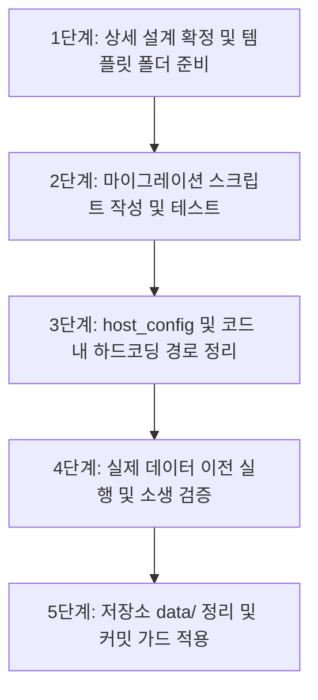

# 사용자 데이터 완전 분리 설계서 (배포 준비)

> 상태: **계획** (2026-09-25)  
> 선행 문서: [user-data-and-editing.md §1](user-data-and-editing.md)  
> 목적: 엔진 코드 저장소와 개인화 데이터(기억, 캐릭터, 세션, 비밀 등)의 물리적·논리적 완전 분리
> 관련(설계): 캐릭터 스코프 **관계 기억** 저장·암호화 경계는 [character-memory-adapter.md](character-memory-adapter.md) Q1–Q2 (본 문서 Memory/`CHATBOT_DATA` 분류와 맞출 것).

---

## 1. 배경 및 목표

1. **배경**:
   - 현재 `services/chatbot` 저장소 아래 `data/` 및 `data/workspace/`에 개인 기억(`MEMORY.md`), 가족/위치 정보, 개인 캐릭터 카드, 세션 로그가 함께 보관되어 있음.
   - 오픈소스 배포, 타 환경 설치, 또는 협업 배포 시 개인정보 유출 위험 및 저장소 비대화 문제 발생.
2. **목표**:
   - **엔진 코드(`services/chatbot/`)**는 100% 재사용 가능하고 개인 데이터가 없는 순수 엔진 저장소로 유지.
   - **사용자 데이터(`CHATBOT_DATA`)**는 기본값 `~/.chatbot` (또는 외부 지정 경로)로 완전히 격리.
   - 새 환경에서 클론 후 실행 시 템플릿(`templates/`)으로부터 사용자 데이터 공간 자동 부트스트랩.
   - 기존 데이터를 유실 없이 이전할 수 있는 멱등성 마이그레이션 도구 제공.

---

## 2. 데이터 분류 및 경로 매핑 SSOT

| 분류 | 대상 파일 / 디렉토리 | 저장 위치 | Git 추적 여부 | 설명 |
|---|---|---|---|---|
| **엔진 (Engine)** | `*.py`, `static/`, `tests/`, `roles/`, `docs/`, `tools/` | 저장소 루트 (`services/chatbot/`) | **추적 (Commit)** | 코드, UI, 기본 역할 팩, 도구 |
| **템플릿 (Templates)** | `templates/team.json`, `templates/characters/`, `templates/AGENTS.md` | 저장소 루트 `templates/` | **추적 (Commit)** | 첫 부트스트랩 시 복사할 기본값 |
| **사용자 설정 (Config)** | `team.json`, `characters/` (카드/스프라이트/`visual.md`), `providers.json` | `$CHATBOT_DATA/` | **제외 (.gitignore)** | 사용자 정의 캐릭터 및 팀 구성 |
| **사용자 기억 (Memory)** | `memory/MEMORY.md`, 캐릭터별 `memory.md`, `private-memory.md` | `$CHATBOT_DATA/memory/`, `$CHATBOT_DATA/characters/<id>/` | **제외 (.gitignore)** | 장기 기억, 페르소나 기억 |
| **런타임 및 세션 (Runtime)** | `sessions/`, `skill-observations/`, `backups/`, `lifecycle.lock`, `*.pid` | `$CHATBOT_DATA/runtime/` 또는 `$CHATBOT_DATA/sessions/` | **제외 (.gitignore)** | 대화 세션, 자체진화 티켓/관찰, 백업 |
| **비밀 정보 (Secrets)** | `secrets.env`, API 키 토큰 | `$CHATBOT_DATA/secrets.env` (권한 0600) | **제외 (.gitignore)** | 민감 자격증명 |

---

## 3. 아키텍처 및 경로 추상화 설계

### 3.1 `host_config.py` 기준 경로 체계 개편
현재 `host_config.py`는 `DATA = Path(_env("CHATBOT_DATA", ..., ROOT / "data"))`로 이미 환경변수를 지원하도록 기초 설계되어 있음.
이를 다음과 같이 표준화:

```python
# host_config.py
ROOT = Path(_env("CHATBOT_ROOT", "AGY_CHAT_ROOT", str(Path(__file__).resolve().parent)))
# 기본값을 ~/.chatbot 으로 점진 전환 (또는 개발 환경 기본값 호환)
DEFAULT_DATA_DIR = Path.home() / ".chatbot"
DATA = Path(_env("CHATBOT_DATA", "AGY_CHAT_DATA", str(DEFAULT_DATA_DIR)))

# 하위 구조 표준화
WORKSPACE = DATA / "workspace"
CONFIG_DIR = DATA
MEMORY_DIR = WORKSPACE / "memory"
SESSIONS = DATA / "sessions"
OBSERVATIONS = WORKSPACE / "skill-observations"
BACKUPS = DATA / "backups"
SECRETS_FILE = DATA / "secrets.env"
```

### 3.2 신규 설치 시 부트스트랩 (Bootstrap) 흐름
1. `server.py` 또는 `host_config.py` 구동 시 `DATA` 디렉토리 존재 여부 확인.
2. 미존재 시 디렉토리 생성 및 `ROOT / "templates"`의 기본 파일 복사:
   - `templates/team.json` -> `$CHATBOT_DATA/workspace/team.json`
   - `templates/characters/default/` -> `$CHATBOT_DATA/workspace/characters/char_default/`
   - `templates/AGENTS.md` -> `$CHATBOT_DATA/workspace/AGENTS.md`
   - 빈 `MEMORY.md` 초기화
3. `secrets.env` 부재 시 `templates/secrets.env.example` 복사 (0600 권한).

---

## 4. 단계별 실행 계획



### 1단계: 템플릿 폴더(`templates/`) 체계화
- 저장소 내에 공용 기본값 저장:
  - `templates/workspace/team.json`
  - `templates/workspace/AGENTS.md`
  - `templates/workspace/PROJECT.md`
  - `templates/characters/` (기본 캐릭터 1종)

### 2단계: 데이터 이전 도구 (`tools/migrate_user_data.py`)
- 기존 `services/chatbot/data`에 존재하는 파일들을 목표 `$CHATBOT_DATA`(예: `~/.chatbot` 또는 지정 위치)로 복사/이동.
- 멱등성 보장: 이미 복사된 파일은 건너뛰며, 원본은 백업 디렉토리에 보존.
- 심볼릭 링크 모드 지원(개발 중 호환성을 위해 `data -> ~/.chatbot` 심볼릭 링크 옵션 제공 가능).

### 3단계: 코드 내 상대경로/하드코딩 정리
- `server.py`, `mcp_server.py`, `memory_store.py`, `delegation.py` 등에서 문자열 `"data/"`로 하드코딩된 부분을 `host_config.DATA` 기준으로 통일.

### 4단계: 실제 이전 및 서비스 검증
- 실장님 승인 하에 `python3 tools/migrate_user_data.py` 실행.
- 서비스 재기동(소생) 후 정상 세션, 기억, 캐릭터 로드 확인.

### 5단계: 저장소 정리 및 원격 히스토리 가드
- `services/chatbot/.gitignore`에 `data/`를 전면 추가하여 로컬 작업 잔여물이 git에 절대 잡히지 않도록 차단.
- `.pre-commit` 또는 커밋 전 검사 스크립트에 `MEMORY.md`, 자택/가족 키워드 검출기 배치.
- *(원격 히스토리 재작성은 실장님 별도 판단 시 진행)*

---

## 5. 영향 및 리스크 평가

- **호스트 소생 필요**: `host_config.py` 및 서버 경로 변경 시 **⚡소생** 필요.
- **기존 세션/기억 연속성**: 이전 스크립트에서 파일 이동 후 심볼릭 링크(`data -> ~/.chatbot`)를 임시 유지하면 무중단/오류 없이 이전 가능.
- **외부 스크립트 의존성**: `chatbot-ctl.sh`에서 `CHATBOT_DATA` 환경변수 기본값을 export 하도록 1줄 추가 필요.
