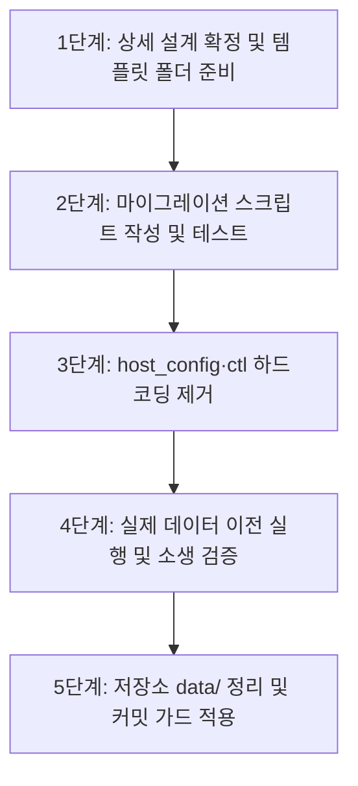

# 사용자 데이터 완전 분리 설계서 (배포 준비)

> 방향 (align/D, 2026-09-28): **기반** — `~/.pe` 분리 — 개인화 레이어가 엔진 업데이트에 덮어써지지 않게 하는 전제

> 상태: **active** (갱신 2026-09-27; 초안 2026-09-25)
> 선행 문서: [user-data-and-editing.md §1](user-data-and-editing.md)
> 목적: 엔진 코드 저장소와 개인화 데이터(기억, 캐릭터, 세션, 비밀 등)의 물리적·논리적 완전 분리
> 관련: [release-pipeline.md](release-pipeline.md) · [private-engine-brand.md](private-engine-brand.md) · [character-memory-adapter.md](character-memory-adapter.md) Q1–Q2 (Memory/`CHATBOT_DATA` 분류와 맞출 것) · [CONCEPT.md](../CONCEPT.md)

---

## 0. 경로 SSOT (2026-09-27 확정 방향)

| 항목 | 값 |
|---|---|
| **기본 사용자 데이터 디렉터리** | `~/.pe` (**`~/.privateengine` 아님** — 별도 별칭이 없으면 쓰지 않음) |
| **환경변수 (우선순위)** | `CHATBOT_DATA` → `PE_HOME` → `PRIVATEENGINE_HOME` → (레거시) `AGY_CHAT_DATA` → 기본 `~/.pe` |
| **개발 오버라이드** | `CHATBOT_DATA=$CODE/data` (저장소 옆 `data/` 유지 — 현행 NAS/FIREBAT 개발 흐름) |
| **ctl** | `chatbot-ctl.sh`의 `DATA="$CODE/data"` **하드코딩 제거** 필수. 위 env/기본값을 따르고, 개발 시에만 `$CODE/data`를 export |
| **Windows** | `%USERPROFILE%\.pe` (단기). XDG/`LOCALAPPDATA` 등은 이후 |
| **브랜드 별칭** | `PE_HOME` / `PRIVATEENGINE_HOME`은 **선택적 별칭** — SSOT 이름은 `CHATBOT_DATA` (코드·문서 통일). `~/.privateengine`은 기본값이 아님 |

**uds/B 완료(2026-09-28, #284)**: 경로 결정은 `host_config.py::DATA_ENV` 한 곳(`CHATBOT_DATA` → `PE_HOME` → `PRIVATEENGINE_HOME` → `AGY_CHAT_DATA` → `ROOT/data`). `tickets.py`(코어)는 같은 순서를 되풀이하고 `test_data_paths`가 둘을 같게 묶는다. `mcp_server.py`·`logdigest.py`의 우회 제거, `chatbot-ctl.sh`도 같은 순서. 남은 것: `data/` 안의 엔진 설정표(`content_guards.json`, `private_tension_*.json`)를 저장소 쪽으로 옮기기(분류 감사), `~/bin/ticket-quick`의 고정 경로(pew/K). 이전 기록 — 현재 코드: `host_config.py`는 `CHATBOT_DATA`/`AGY_CHAT_DATA` → 없으면 `ROOT/data`. `chatbot-ctl.sh`의 `DATA="$CODE/data"` 줄이 고정 후 export. **배포 기본 `~/.pe`로의 전환은 아직 미착수** — 본 문서 + [release-pipeline.md](release-pipeline.md) Next 구간.

---

## 1. 배경 및 목표

1. **배경**:
   - 현재 `services/chatbot` 저장소 아래 `data/` 및 `data/workspace/`에 개인 기억(`MEMORY.md`), 가족/위치 정보, 개인 캐릭터 카드, 세션 로그가 함께 보관되어 있음.
   - 오픈소스 배포, 타 환경 설치, 또는 협업 배포 시 개인정보 유출 위험 및 저장소 비대화 문제 발생.
2. **목표**:
   - **엔진 코드(`services/chatbot/`)**는 100% 재사용 가능하고 개인 데이터가 없는 순수 엔진 저장소로 유지.
   - **사용자 데이터(`CHATBOT_DATA`)**는 기본값 **`~/.pe`** (또는 외부 지정 경로)로 완전히 격리.
   - 새 환경에서 클론 후 실행 시 템플릿(`templates/`)으로부터 사용자 데이터 공간 자동 부트스트랩.
   - 기존 데이터를 유실 없이 이전할 수 있는 멱등성 마이그레이션 도구 제공.
   - 개발 머신에서는 `CHATBOT_DATA=$CODE/data`로 현행 레이아웃을 깨지 않음.

---

## 2. 데이터 분류 및 경로 매핑 SSOT

| 분류 | 대상 파일 / 디렉토리 | 저장 위치 | Git 추적 여부 | 설명 |
|---|---|---|---|---|
| **엔진 (Engine)** | `*.py`, `static/`, `tests/`, `roles/`, `docs/`, `tools/` | 저장소 루트 (`services/chatbot/`) | **추적 (Commit)** | 코드, UI, 기본 역할 팩, 도구 |
| **템플릿 (Templates)** | `templates/team.json`, `templates/characters/`, `templates/AGENTS.md` | 저장소 루트 `templates/` | **추적 (Commit)** | 첫 부트스트랩 시 복사할 기본값 |
| **사용자 설정 (Config)** | `team.json`, `characters/` (카드/스프라이트/`visual.md`), `providers.json` | `$CHATBOT_DATA/` | **제외 (.gitignore)** | 사용자 정의 캐릭터 및 팀 구성 |
| **사용자 기억 (Memory)** | `memory/MEMORY.md`, 캐릭터별 `memory.md`, `private-memory.md` | `$CHATBOT_DATA/memory/`, `$CHATBOT_DATA/characters/<id>/` | **제외 (.gitignore)** | 장기 기억, 페르소나 기억 |
| **런타임 및 세션 (Runtime)** | `sessions/`, `skill-observations/`, `backups/`, `lifecycle.lock`, `*.pid` | `$CHATBOT_DATA/runtime/` 또는 `$CHATBOT_DATA/sessions/` | **제외 (.gitignore)** | 대화 세션, 자체진화 티켓/관찰, 백업 |
| **비밀 정보 (Secrets)** | `secrets.env`, API 키 토큰 | `$CHATBOT_DATA/secrets.env` (권한 0600) | **제외 (.gitignore)** | 민감 자격증명 |

---

## 2.1 분류 감사 (uds/C, 2026-09-28)

`git ls-files data` = **426개**. §2의 분류를 실제 파일에 적용한 결과다. 옮기기·추적 해제는 아래 결정(C1–C6) 뒤에 항목별로 한다.

| 묶음 | 파일 수 | 분류 | 가야 할 곳 | 비고 |
|---|---|---|---|---|
| `content_guards.json`, `private_tension_{defaults,gemini,grok}.json`, `private_refusal_mitigation_gemini.json` | 5 | **엔진** | 저장소의 엔진 폴더(C1) | 코드가 읽는 규칙표. `data/`가 `~/.pe`로 가면 엔진이 못 찾는다(`test_data_paths` 허용 목록의 이유) |
| `providers.json` | 1 | **템플릿** | `templates/`의 기본값 → 설치 때 `~/.pe`로 복사 | 사용자가 API 프로바이더를 더하면 사용자 데이터가 된다 |
| `workspace/AGENTS.md`, `PROJECT.md`, `CROSS-CUTTING-PRINCIPLES.md`, `team.json`, `.mcp.json`, `.gemini/config/mcp_config.json`, `.gitignore` | 7 | **템플릿** | `templates/workspace/` → 부트스트랩(uds/D) | 챗 에이전트 헌장·기본 팀·CLI MCP 설정 |
| `workspace/SELF-MODIFY.md`, `roles/pd/procedure.md` | 2 | **개발판 템플릿** | 개발판에서만(edition) | 엔진 코드 자가진화 절차 |
| `workspace/roles/{artist,staff,pd}/role.md` | 3 | **템플릿** | `templates/workspace/roles/` | 역할 팩(pd는 배포판용으로 다듬기, pew/L) |
| `workspace/tools/*.py`(memory·recall_memory·lunar_calendar·token_audit) | 4 | **템플릿(에이전트 도구)** | `templates/workspace/tools/` | 에이전트가 쓰는 도구 스크립트 |
| `workspace/.agents/skills/*`(character-art·character-pipeline·image-brief·fact-check·anime-layer-animator) | 7 | **템플릿(기본 스킬)** | `templates/workspace/.agents/skills/` | 표준 `SKILL.md` |
| `workspace/.agents/skills/nas-sphere` | 1 | **환경 플러그인** | NAS 설치에만 | align/F와 같은 성격 |
| `persona/providers/*` | 12 | **엔진(UI 자산)** | `static/` 쪽 | 프로바이더 아이콘 |
| `persona/*`(avatar·half·wave·face-icon·icon·bg-studio·gallery·README) | 24 | **템플릿(기본 캐릭터 자산)** | 프리메이드 팩 | 기본 페르소나 이미지 |
| `workspace/characters/<id>/`(3명: card·visual·avatar·stage·gallery) | 43 | **템플릿 후보 + 사용자** | 프리메이드 팩으로 고를 것만(C3) | `memory.md`는 사용자 데이터 |
| `workspace/memory/MEMORY.md` | 1 | **사용자(개인 정보)** | 추적 해제(C4) | 사용자·가족·위치 사실이 들어 있다 |
| `workspace/characters/*/memory.md` | 1 | **사용자** | 추적 해제(C4) | 캐릭터별 기억 |
| `sessions/_shared/*`, `session-quarantine/*` | 42 | **사용자·런타임** | 추적 해제(C4) | 공유 아티팩트, 격리된 세션 메타 |
| `workspace/skill-observations/`(tickets 209·observation-log 62·기타 3) | 274 | **개발판 기록** | 개발 저장소에 남김(C2) | 이 엔진의 개발 이력. 배포판 `~/.pe`는 빈 상태로 시작 |

### 결정 (uds/C)

| C | 질문 | 추천 | 상태 |
|---|---|---|---|
| C1 | 엔진 규칙표 5개의 자리 | 저장소 `engine_data/`(가칭)로 옮기고 `content_guard.py`·`private_engine.py`가 `host_config.ROOT` 기준으로 읽는다. `test_data_paths` 허용 목록에서 두 항목 제거 | 결정 2026-09-28 (운영자: 추천대로) |
| C2 | 개발판 기록(티켓·관찰, 274개) | 개발 저장소에 그대로 둔다(개발판은 `CHATBOT_DATA=$CODE/data`). 배포 패키지에서는 제외(edition/F) | 결정 2026-09-28 (운영자: 추천대로) |
| C3 | 기본 캐릭터 | 프리메이드 팩 후보를 운영자가 고른다. 고른 캐릭터에서 사적 규칙·기억 등 개인 부분을 걷어 템플릿으로. 가져온 저작권 캐릭터(예: 게임 캐릭터 카드)는 팩에서 제외 | 보류 — 운영자가 프리메이드 팩 후보를 고른 뒤 |
| C4 | 개인 정보·런타임 파일(45개) | **지금 추적 해제**(`git rm --cached` + `.gitignore`, 파일은 로컬에 남음). 과거 이력에 남은 부분의 정리(히스토리 재작성)는 운영자가 따로 결정(release-pipeline What NOT) | 결정·실행 2026-09-28 (#290: 44개 추적 해제, 파일은 로컬에 남음; 과거 이력 정리는 별도 결정) |
| C5 | 템플릿으로 갈 파일(약 60개)의 이동 방식 | `templates/workspace/`로 **복사**해 정본으로 두고, 개발 설치의 `data/` 쪽은 그대로(부트스트랩이 빈 `~/.pe`에만 복사, uds/D) | 결정 2026-09-28 (운영자: 추천대로) |
| C6 | 프로바이더 아이콘 | `static/providers/`로 옮긴다(엔진 UI 자산) | 결정 2026-09-28 (운영자: 추천대로) |

## 3. 아키텍처 및 경로 추상화 설계

### 3.1 `host_config.py` 기준 경로 체계 개편

현재 `host_config.py`는 `DATA = Path(_env("CHATBOT_DATA", ..., ROOT / "data"))`로 환경변수를 지원한다.
목표 표준:

```python
# host_config.py (목표)
ROOT = Path(_env("CHATBOT_ROOT", "AGY_CHAT_ROOT", str(Path(__file__).resolve().parent)))
# 기본값: ~/.pe  (Windows: %USERPROFILE%\.pe)
# ~/.privateengine 은 기본값 아님 — PE_HOME/PRIVATEENGINE_HOME 별칭만 선택적
DEFAULT_DATA_DIR = Path.home() / ".pe"
DATA = Path(
    _env(
        "CHATBOT_DATA",
        "PE_HOME",
        "PRIVATEENGINE_HOME",
        "AGY_CHAT_DATA",
        str(DEFAULT_DATA_DIR),
    )
)

WORKSPACE = DATA / "workspace"
MEMORY_DIR = WORKSPACE / "memory"
SESSIONS = DATA / "sessions"
OBSERVATIONS = WORKSPACE / "skill-observations"
BACKUPS = DATA / "backups"
SECRETS_FILE = DATA / "secrets.env"
```

### 3.2 `chatbot-ctl.sh` — 하드코딩 제거 (MUST)

현재:

```bash
DATA="$CODE/data"  # consolidated under chatbot/ 2026-09-16
# …
export CHATBOT_ROOT="$CODE" CHATBOT_DATA="$DATA"
```

목표:

```bash
# 이미 export된 CHATBOT_DATA / PE_HOME / PRIVATEENGINE_HOME 존중
# 미설정 시: 개발 편의로 기본을 $CODE/data 로 둘지, 배포 기본 ~/.pe 로 둘지는
# release-pipeline Next 단계에서 전환. 하드코딩 한 줄에 묶지 말 것.
CODE="${CODE:-$SCRIPT_DIR}"
if [ -z "${CHATBOT_DATA:-${PE_HOME:-${PRIVATEENGINE_HOME:-}}}" ]; then
  # 전환 전(개발): DATA="$CODE/data"
  # 전환 후(배포 기본): DATA="${HOME}/.pe"
  DATA="$CODE/data"   # ← Next에서 ~/.pe 로 바꾸고, 개발은 env로 오버라이드
else
  DATA="${CHATBOT_DATA:-${PE_HOME:-$PRIVATEENGINE_HOME}}"
fi
export CHATBOT_ROOT="$CODE" CHATBOT_DATA="$DATA"
```

**실장님 경로 요약**: 배포 기본 `~/.pe` · 개발 `CHATBOT_DATA=$CODE/data` · ctl은 CODE/data 고정 금지 · Windows `%USERPROFILE%\.pe`.

### 3.3 신규 설치 시 부트스트랩 (Bootstrap) 흐름

1. `server.py` 또는 `host_config.py` 구동 시 `DATA` 디렉토리 존재 여부 확인.
2. 미존재 시 디렉토리 생성 및 `ROOT / "templates"`의 기본 파일 복사:
   - `templates/team.json` → `$CHATBOT_DATA/workspace/team.json`
   - `templates/characters/default/` → `$CHATBOT_DATA/workspace/characters/char_default/`
   - `templates/AGENTS.md` → `$CHATBOT_DATA/workspace/AGENTS.md`
   - 빈 `MEMORY.md` 초기화
3. `secrets.env` 부재 시 `templates/secrets.env.example` 복사 (0600 권한).

### 3.4 Windows · 크로스플랫폼 메모

| OS | 기본 경로 | 비고 |
|---|---|---|
| Linux / macOS | `~/.pe` | `$HOME/.pe` |
| Windows (단기) | `%USERPROFILE%\.pe` | `Path.home() / ".pe"` 와 동일 |
| Windows (이후) | XDG 또는 `%LOCALAPPDATA%\PrivateEngine` 검토 | 브랜드 확정·인스톨러 단계에서 |

`~/.privateengine`은 **기본값이 아니다**. 필요 시 `PE_HOME`/`PRIVATEENGINE_HOME` 별칭으로만 지정.

---

## 4. 단계별 실행 계획



### 1단계: 템플릿 폴더(`templates/`) 체계화
- 저장소 내에 공용 기본값 저장:
  - `templates/workspace/team.json`
  - `templates/workspace/AGENTS.md`
  - `templates/workspace/PROJECT.md`
  - `templates/characters/` (기본 캐릭터 1종)
  - `templates/secrets.env.example`

### 2단계: 데이터 이전 도구 (`tools/migrate_user_data.py`)
- 기존 `services/chatbot/data` → 목표 `$CHATBOT_DATA`(예: `~/.pe` 또는 지정 위치)로 복사/이동.
- 멱등성: 이미 복사된 파일은 건너뛰며, 원본은 백업 디렉토리에 보존.
- 심볼릭 링크 모드(개발 호환: `data` → `~/.pe` 옵션).

### 3단계: 코드·ctl 경로 정리
- `server.py`, `mcp_server.py`, `memory_store.py`, `delegation.py` 등 `"data/"` 하드코딩 → `host_config.DATA`.
- **`chatbot-ctl.sh` `DATA="$CODE/data"` 제거** 및 env/기본값 체계 적용.

### 4단계: 실제 이전 및 서비스 검증
- 실장님 승인 하에 `python3 tools/migrate_user_data.py` 실행.
- 서비스 재기동(소생) 후 정상 세션, 기억, 캐릭터 로드 확인.

### 5단계: 저장소 정리 및 원격 히스토리 가드
- `.gitignore`에 `data/` 전면 추가.
- 커밋 전 검사(개인정보·비밀 패턴).
- *(원격 히스토리 재작성은 실장님 별도 판단)*

---

## 5. 영향 및 리스크 평가

- **호스트 소생 필요**: `host_config.py`·ctl 경로 변경 시 **⚡소생** 필요.
- **기존 세션/기억 연속성**: 이전 후 심볼릭 링크(`data` → `~/.pe`) 임시 유지 가능.
- **개발 워크플로**: NAS/FIREBAT는 전환 전까지 `CHATBOT_DATA=$CODE/data` 유지. 기본값만 `~/.pe`로 바꿔도 ctl/문서가 따라가지 않으면 깨짐 — ctl·migrate·gitignore를 한 묶음으로.
- **교차**: 배포 일정·CI·런처는 [release-pipeline.md](release-pipeline.md).
