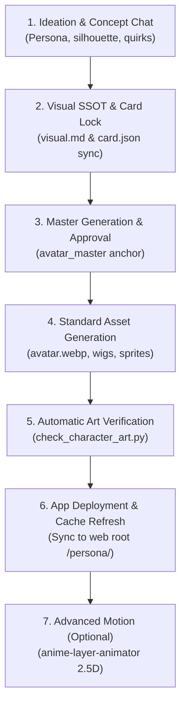

# Character Pipeline (End-to-End Ingestion)

This skill guides the full lifecycle of a character from initial conversation/reference ideation to live UI deployment in the See1 Chatbot app.

## Pipeline Architecture



---

## Step-by-Step Procedure

### 1. Ideation & Reference Alignment
- Chat with the user to establish persona, quirks, voice, species/accents, and key visual contrast with existing characters (e.g. Nono = cat ears/silver waves; Riri = bunny ears/dark ash-brown messy hair).
- Collect reference images in `references/` if provided (study only, git-ignored).

### 2. Lock the SSOT (`visual.md` & `card.json`)
- Before generating final art, define and freeze the visual contract in `characters/<id>/visual.md`:
  - **Style Anchor:** Clean 2D anime digital illustration, thin clean lineart, crisp cel shading.
  - **Character Anchor:** Face, eyes, hair, species ears/tail, base outfit.
  - **Negative Lock:** Unwanted traits, dark/gloomy vibes, duplicate species ears.
- Update `characters/<id>/card.json` (`description`, `personality`, `system_prompt`) to reflect the exact visual personality.

### 3. Generate Master Image & Operator Approval
- Produce `avatar_master.jpg` (or `.png`) using the locked prompt specification.
- Present it to the user. **Once approved, this image becomes the immutable anchor** for all future I2I/expression derivatives. Never regenerate from scratch.

### 4. Build App-Standard Assets
Generate/derive required files under `$CHATBOT_DATA/workspace/characters/<id>/`:
- **`avatar.webp`** (512x512, <=200KB): Full-bleed square. Face fills the 56px circle (eyes in the upper half, chin above the bottom third, species ears in frame). No inner circle on empty canvas. Bust and body go in sprites.
- **`avatar/<provider>.webp`** (512x512): Optional per-brain wigs (hair cut/dye + outfit only, same face).
- **`sprites/bust/<label>.webp`** (1024x1024, transparent, <=400KB):
  - Start with `neutral`, then derive `joy`, `embarrassment`, `anger`.
  - **Body-lock rule:** Body and canvas framing must remain 100% stationary; edit only facial expressions.

### 5. Automated Verification
Run the validator from `services/chatbot`:
```bash
python3 tools/check_character_art.py <character_id>
```
Ensure output is `ok <name> (<id>)` with zero errors.

### 6. Deploy to Web Root & Live Check
- Sync files to web root for the app and Hub:
  - Hub persona path: `/volume1/web/chat/persona/` and `data/persona/`
- Advise user to refresh the browser to verify the new assets in the live UI.

### 7. Advanced Motion Layering (Optional)
- For 2.5D eye-tracking, breathing, and ear/tail sway, pass the approved sprite to the `anime-layer-animator` skill to decompose layers into web motion viewers.

---

## Tooling Quick Reference
- Verify assets: `python3 tools/check_character_art.py <id>`
- Card check: `characters/<id>/card.json`
- Lock sheet: `characters/<id>/visual.md`
