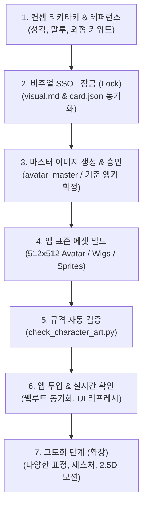

# 캐릭터 디자인 & 앱 투입 파이프라인 (Character Ingestion Pipeline)

See1 챗봇 생태계에서 새 캐릭터를 만들거나 기존 캐릭터 룩을 개편할 때, **아이데이션부터 최종 앱 확인까지 무결하게 이어지는 표준 프로세스** 가이드입니다.

---

## 전체 흐름도 (Lifecycle Overview)



---

## 단계별 세부 절차

### 1단계: 컨셉 디자인 & 티키타카 (Ideation)
* **목표:** 캐릭터의 페르소나와 외형을 대화나 레퍼런스 이미지로 구체화.
* **주요 확인 항목:**
  * 기본 정보: 이름, 역할, 종족/특징 (예: 고양이귀, 토끼귀, 사이보그 등).
  * 화풍(Style): 모던 2D 아니메 규격 (얇은 선화, 셀 셰이딩 등).
  * 키 컬러 & 실루엣: 노노(은발/금안/블라우스), 리리(흑갈색/자안/오버핏 후드)처럼 기존 캐릭터와 확실한 차별화.

### 2단계: 비주얼 SSOT 잠금 (Visual Lock)
* **목표:** 프롬프트 드리프트(재생성 시 얼굴/스타일이 계속 바뀌는 현상) 방지.
* **산출물:**
  * `characters/<id>/visual.md`: 화풍 앵커, 캐릭터 앵커, 네거티브 락, 프레이밍 SSOT 문서.
  * `characters/<id>/card.json`: 성격, 시스템 프롬프트, 소개 문구를 비주얼 룩과 1:1 일치화.

### 3단계: 마스터 앵커 생성 (Master Anchor)
* **목표:** 모든 파생 이미지의 기준이 되는 마스터 이미지 확정.
* **규칙:**
  * `avatar_master.jpg` (또는 `.png`): 고화질 마스터 컷 생성 후 코치 승인 획득.
  * 승인된 마스터 이미지는 절대 덮어쓰지 않고 락(Lock)을 건다.

### 4단계: 앱 규격 에셋 생성 (Asset Generation)
* **목표:** 앱(See1 Chatbot UI)에서 요구하는 표준 파일 포맷/크기로 변환 및 파생.
* **포맷 규격 (`character-art` 기준):**
  1. `avatar.webp` (512x512, <=200KB): 56px 원형 크롭에 얼굴과 핵심 포인트(귀, 헤어 등)가 완벽히 들어오는 기본 룩.
  2. `avatar/<provider>.webp` (512x512): 브레인(모델)별 가발/의상 바리에이션. 마스터 얼굴을 유지한 상태에서 I2I/인페인팅.
  3. `sprites/bust/<label>.webp` (1024x1024, 투명 배경, <=400KB):
     * `neutral`(기본), `joy`(기쁨), `embarrassment`(부끄/고장), `anger`(버럭) 등.
     * **바디 고정 원칙:** 몸체와 캔버스 위치는 동일하게 유지하고 얼굴 표정만 차분.

### 5단계: 규격 자동 검증 (Validation)
* **목표:** 배포 전 규격(해상도, 용량, 파일 구조) 오류를 사전에 차단.
* **실행 명령:**
  ```bash
  python3 tools/check_character_art.py <character_id>
  ```
  * `ok <이름> (<id>)`가 나와야 다음 단계로 진행.

### 6단계: 앱 투입 & 확인 (Deployment & Verification)
* **목표:** 챗봇 웹 UI 및 허브에서 즉시 시각적으로 확인.
* **반영 경로:**
  * 로컬 캐릭터 폴더: `characters/<id>/`
  * 웹 루트/허브 동기화: `/volume1/web/chat/persona/` 및 `data/persona/`
* **확인:** 웹 브라우저 새로고침(또는 캐시 리프레시) 후 아바타 및 반응 확인.

---

## 7단계: 향후 고도화 확장 로드맵 (Evolution)
* **표정/감정 엔진 연동:** 대화 감정 분석에 맞춰 실시간으로 표정 스프라이트(`sprites/bust/<label>.webp`) 자동 전환.
* **2.5D 모션 뷰어 연동 (`anime-layer-animator`):**
  * 단일 2D 일러스트 → 레이어 분리(PSD/PNG) → 눈 깜빡임(Blink), 시선 추적, 호흡, 귀 쫑긋/꼬리 흔들림 웹 모션 구현.
